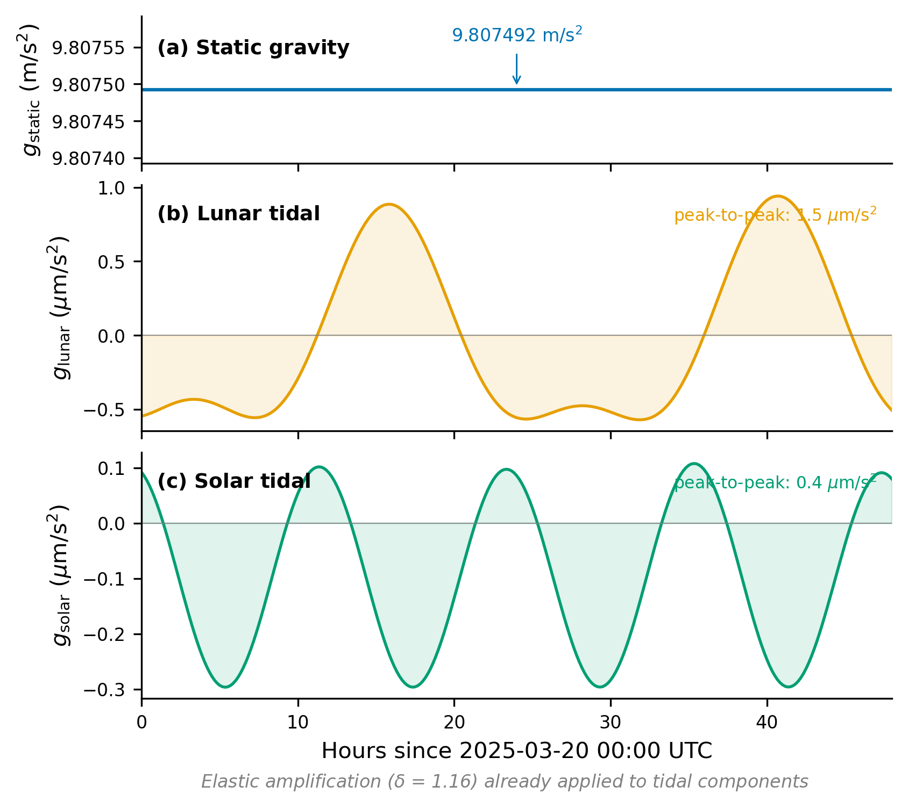

# 1. Introduction: What Does a Gravimeter Read?

## 1.1 The Question

Bolt a gravimeter to bedrock in Munich ($\varphi = 48.14°$N, $\lambda = 11.58°$E, $h = 500$ m above GRS80). The display settles near 9.807 m/s$^2$, but the last decimal places drift by $\sim$1 $\mu$m/s$^2$ over twelve hours, tracing a nearly sinusoidal oscillation that repeats -- not quite -- twice per day. Three contributors account for this:

**Static field.** Earth's gravitational attraction plus centrifugal acceleration from rotation, depending on $\varphi$ and $h$. Time-independent; magnitude $\sim$9.8 m/s$^2$.
**Lunar tide.** Differential lunar pull between observer and Earth's center. Quadrupolar (degree-2) structure yields a semi-diurnal period of $\sim$12.4 h; peak $\sim$1.1 $\mu$m/s$^2$.
**Solar tide.** Same mechanism, weaker by the $R^{-3}$ tidal scaling: peak $\sim$0.5 $\mu$m/s$^2$.

The total is their sum, with tidal terms amplified by the solid Earth's elastic response ($\delta \approx 1.16$) and projected onto the sensor axis. A superconducting gravimeter resolves parts-per-billion accelerations; the tidal signal exceeds its noise floor by three orders of magnitude. The Pytheas library -- named after Pytheas of Massalia (c. 325 BC), the first to record a systematic Moon--tide connection -- implements the formulas derived in this document.

---

## 1.2 The Formula at a Glance

$$\boxed{g_{\text{total}}(t) = \gamma(\varphi, h)\,(\hat{\mathbf{e}}_U \cdot \hat{\mathbf{n}}) + \delta\left[\mathbf{a}_{\text{moon}}(t) + \mathbf{a}_{\text{sun}}(t)\right] \cdot \hat{\mathbf{n}}} \tag{1.1}$$

**$\gamma(\varphi, h)$: Normal gravity.** Static baseline from Earth's mass and rotation. Ranges 9.780 (equator) to 9.832 m/s$^2$ (poles), decreasing $\sim$0.3 mGal/m with elevation. Somigliana closed-form on GRS80 + second-order free-air correction (Section 3).

**$\mathbf{a}_{\text{moon}}(t)$, $\mathbf{a}_{\text{sun}}(t)$: Tidal acceleration vectors.** Difference between each body's pull at the observer and at Earth's center:

$$\mathbf{a}_{\text{tidal}} = GM\left[\frac{\mathbf{R} - \mathbf{r}}{|\mathbf{R} - \mathbf{r}|^3} - \frac{\mathbf{R}}{R^3}\right] \tag{1.2}$$

with $\mathbf{R}$ the body's position, $\mathbf{r}$ the observer's, $GM$ the gravitational parameter (Section 6).

**$\delta$: Gravimetric factor.** Elastic deformation amplifies the tidal signal. Direct gravity, free-air displacement, and mass redistribution combine into $\delta \approx 1.16$ (Section 7).

**$\hat{\mathbf{n}}$: Measurement axis.** Sensor direction in the local ENU frame (Section 2). For a vertical gravimeter ($\hat{\mathbf{n}} = \hat{\mathbf{e}}_U$):

$$g_{\text{total}}(t) = \gamma(\varphi, h) + \delta\left[\mathbf{a}_{\text{moon}}(t) + \mathbf{a}_{\text{sun}}(t)\right] \cdot \hat{\mathbf{e}}_U \tag{1.3}$$

The decomposition $g = g_{\text{static}} + g_{\text{tidal}}$ has perturbation-theoretic structure: a time-independent baseline plus corrections suppressed by $\sim$$10^{-7}$ that encode lunar and solar positions.



Figure 12: (a) $g_{\text{static}} = 9.807402$ m/s$^2$ (Somigliana + free-air, Munich, 500 m). (b) Lunar tide, p-p $\sim$1.5 $\mu$m/s$^2$. (c) Solar tide, $\sim$$2\times$ smaller. Both include $\delta = 1.16$.

---

## 1.3 A 48-Hour Portrait

Figure 1: 48 hours of $g(t)$ at Munich from 2025-03-20 00:00 UTC (equinox). Panel (a): total $g$ -- tidal modulation invisible at full scale. Panel (b): after baseline removal, the M2 semi-diurnal tide emerges at $\sim$12.4 h period; lunar (dashed) $\sim$$2\times$ solar (dotted); weekly interference produces spring--neap modulation.

The 12.4 h period arises because the Moon advances $\sim$13°/day, so the semi-diurnal period is half a lunar day ($\approx$12 h 25 min). Two daily maxima reflect the degree-2 potential $\propto \cos^2\theta$, with maxima at $\theta = 0$ (sub-lunar) and $\theta = \pi$ (anti-lunar). Atmospheric pressure, drift, and microseismic noise are excluded (Subsection 1.5).


---

## 1.4 Roadmap

Evaluating equation (1.1) requires six ingredients:

**Section 2 -- Coordinates.** GRS80 ellipsoid-to-ECEF conversion ($N(\varphi)$), GMST rotation between Earth-fixed and inertial frames, ENU basis defining $\hat{\mathbf{n}}$.
**Section 3 -- Normal Gravity.** $\gamma(\varphi, h)$ via Somigliana + second-order free-air expansion in $h/a$. Equator-to-pole variation $\sim$0.05 m/s$^2$.
**Section 4 -- Lunar Position.** Meeus ephemeris: $\sim$65 perturbation terms, five fundamental arguments. Dominant: equation of center (6.29°), evection (1.27°), variation (0.66°). Accuracy $\sim$10 arcsec.
**Section 5 -- Solar Position.** Near-Keplerian ($e \approx 0.017$), three-term equation of center from $O(e^3)$ Kepler expansion. Accuracy $\sim$1 arcmin ($<$1 nGal).
**Section 6 -- Tidal Acceleration.** Exact formula (1.2) and $R^{-3}$ scaling. Gradient approximation: $\sim$2,800 nGal truncation; Pytheas uses the exact form.
**Section 7 -- Elastic Response.** $\delta = 1 + h_2 - \frac{3}{2}k_2 = 1.16$: displacement ($h_2 \approx 0.61$) amplifies, mass redistribution ($\frac{3}{2}k_2 \approx 0.45$) reduces; net 16%.

Each section includes worked examples and Pytheas code.

---

## 1.5 The Error Budget at a Glance

Model accuracy: $\sim$10 nGal inland, $\sim$50 nGal coastal (1 nGal = $10^{-11}$ m/s$^2$). Two scaling relations govern the analysis:

$$a_{\text{tidal}} \sim \frac{2\,GM\,r}{R^3} \tag{1.4}$$

$$\delta = 1 + h_2 - \frac{3}{2}\,k_2 \tag{1.5}$$

with IERS 2010 Love numbers $h_2 = 0.6078$, $k_2 = 0.2980$, giving $\delta = 1.1608$ (Section 7). Equation (1.4) explains why the closer Moon dominates the more massive Sun (Section 6).

**Dominant error:** frequency-independent $\delta$. Near K1 ($\sim$23.93 h), Free Core Nutation resonance alters $\delta$ by $\sim$1% $\Rightarrow$ $\sim$10 nGal. **Secondary:** lunar ephemeris ($\sim$10 arcsec) $\to$ $\sim$1 nGal RMS; solar ($\sim$1 arcmin) $<$1 nGal; normal gravity exact on the ellipsoid to machine precision.


Figure 13 ranks all sources: modeled effects $<$1 nGal; frequency-independent $\delta$ at $\sim$10 nGal; unmodeled ocean loading (1--50 nGal) and atmospheric pressure ($\sim$3 nGal/hPa) set a separate floor. Deliberately omitted effects (each requiring external data incompatible with the numpy-only architecture):

- **Ocean tidal loading** (1--50 nGal): site-specific coefficients from FES2014.
- **Atmospheric pressure loading** ($\sim$3 nGal/hPa): real-time barometric data.
- **Polar motion** ($<$1 nGal): IERS orientation parameters.
- **Planetary tides** ($<$0.1 nGal): negligible.

Setting $\delta = 1$ (rigid Earth) introduces $\sim$18,000 nGal error; the elastic correction is essential. Superconducting gravimeters reach $\sim$0.1--1 nGal; our 10 nGal floor is a deliberate sweet spot between accuracy and first-principles simplicity.

---

## 1.6 Notation and Conventions

**Units.** SI throughout. Angles in radians unless stated; time in UTC. Tidal signals in $\mu$Gal ($10^{-8}$ m/s$^2$) or nGal ($10^{-11}$ m/s$^2$). Signal $O(100\;\mu\text{Gal})$; accuracy floor 10 nGal.

**Notation.**

| Symbol | Meaning | Defined in |
|--------|---------|------------|
| $\varphi$, $\lambda$, $h$ | Geodetic latitude, longitude, altitude | Section 2 |
| $\gamma(\varphi, h)$ | Normal gravity (Somigliana + free-air) | Section 3 |
| $\mathbf{R}_{\text{Moon}}(t)$, $\mathbf{R}_{\text{Sun}}(t)$ | ECEF position vectors of Moon, Sun | Sections 4, 5 |
| $\mathbf{r}$ | Observer's ECEF position vector | Section 2 |
| $\mathbf{a}_{\text{tidal}}$ | Tidal acceleration vector | Section 6 |
| $\delta$ | Gravimetric factor (= 1.1608) | Section 7 |
| $\hat{\mathbf{n}}$ | Measurement axis unit vector | Section 2 |
| $\hat{\mathbf{e}}_U$, $\hat{\mathbf{e}}_N$, $\hat{\mathbf{e}}_E$ | Local Up, North, East unit vectors | Section 2 |
| GMST | Greenwich Mean Sidereal Time | Section 2 |

**Code.** Python/NumPy; names mirror notation (`H2`, `K2`, `DELTA_GRAV`). Top-level API:

```python
from datetime import datetime
from pytheas import compute_g

result = compute_g(
    dt=datetime(2025, 3, 20, 12, 0, 0),  # UTC time
    lat_deg=48.14,                         # Munich latitude
    lon_deg=11.58,                         # Munich longitude
    alt_m=500.0,                           # altitude above GRS80
)

print(f"g_total  = {result['g_total']:.6f} m/s²")
print(f"g_static = {result['g_static']:.6f} m/s²")
print(f"g_tidal  = {result['g_tidal'] * 1e6:.3f} μm/s²")
```
