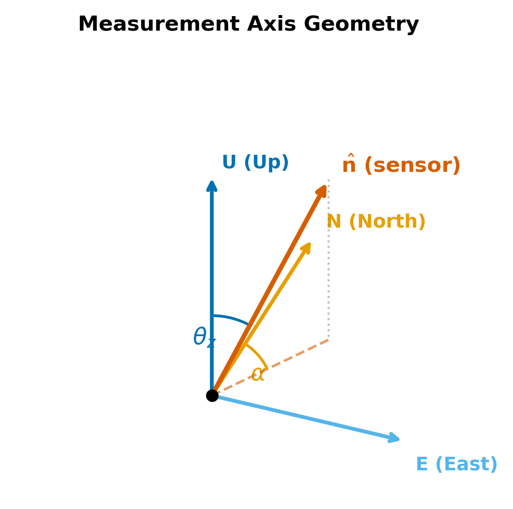

# Section 2: Setting Up Coordinates

Before we can compute the gravitational acceleration at a point on Earth, we need a precise language for describing *where* that point is, *where* celestial bodies are, and how those two descriptions relate.  This section builds the full coordinate pipeline from the ground up: we start with the numbers a human types in (latitude, longitude, altitude), convert them to vectors in three-dimensional space, and finally construct the direction along which our gravimeter is sensitive.

Every coordinate system we introduce solves a specific problem.  Geodetic coordinates are how we label positions on a squashed Earth.  ECEF (Earth-Centered Earth-Fixed) is where we do local physics.  ECI (Earth-Centered Inertial) is where astronomical ephemerides live.  ENU (East-North-Up) is what the observer actually experiences.  The conversions between them form the backbone of Pytheas.

---

## 2.1 Geodetic Coordinates: Latitude, Longitude, Altitude

### What they are

Every point near Earth's surface can be labeled by three numbers:

- **Geodetic latitude** $\varphi$ (phi): the angle between the equatorial plane and the *outward normal* to the reference ellipsoid at that point.  Positive in the northern hemisphere, negative in the southern.  Ranges from $-90^\circ$ to $+90^\circ$.

- **Geodetic longitude** $\lambda$ (lambda): the angle measured eastward in the equatorial plane from the prime meridian (Greenwich).  Ranges from $-180^\circ$ to $+180^\circ$ (or equivalently $0^\circ$ to $360^\circ$).

- **Ellipsoidal height** $h$: the distance above the reference ellipsoid, measured along the outward normal.  Not the same as "altitude above sea level" (that involves the geoid), but the difference is typically tens of meters and does not matter for tidal calculations.

These three numbers $(\varphi, \lambda, h)$ are exactly what a GPS receiver reports.  They are the input that Pytheas accepts from the user.

### Why an ellipsoid?

The Earth is not a sphere.  It spins, and the centrifugal effect of that spin pushes mass outward at the equator.  The result is an oblate shape: the equatorial radius exceeds the polar radius by about 21 km.  A sphere would introduce position errors of that magnitude -- far too large for a tool aiming at nanoGal-level gravity modeling.  The standard approximation is an *ellipsoid of revolution*, a surface generated by rotating an ellipse about its shorter (polar) axis.

---

## 2.2 The GRS80 Reference Ellipsoid

The Geodetic Reference System 1980 (GRS80) defines the ellipsoid that Pytheas uses.  It is characterized by two numbers from which everything else follows.

**Semi-major axis** (equatorial radius):

$$a = 6\,378\,137.0 \text{ m}$$

**Flattening:**

$$f = \frac{1}{298.257222101} \approx 3.353 \times 10^{-3}$$

The flattening is defined as the fractional difference between equatorial and polar radii:

$$f = \frac{a - b}{a}$$

so the **semi-minor axis** (polar radius) is:

$$b = a(1 - f) = 6\,356\,752.314 \text{ m}$$

The equator-to-pole difference is $a - b \approx 21\,385$ m, roughly 21 km.  This is small compared to $a$ (about 0.3%), but it is enormous compared to the scales that matter for precision gravimetry.

We will also need the **first eccentricity squared**, a convenient dimensionless measure of how much the ellipse departs from a circle:

$$e^2 = 2f - f^2 = \frac{a^2 - b^2}{a^2}$$

Plugging in the GRS80 values:

$$e^2 = 2 \times 3.353\times10^{-3} - (3.353\times10^{-3})^2 \approx 6.694 \times 10^{-3}$$

This small parameter will appear repeatedly in our formulas; its smallness is why the ellipsoid is "almost" a sphere.

---

## 2.3 Geodetic vs. Geocentric Latitude

There is a subtlety lurking in the definition of latitude on an ellipsoid, and it matters enough to address head-on.

**Geocentric latitude** $\varphi'$ is the angle between the equatorial plane and the line from the center of the Earth to the point on the surface.  This is the "obvious" definition.

**Geodetic latitude** $\varphi$ is the angle between the equatorial plane and the line *perpendicular to the ellipsoid surface* at that point.  This is the definition used by GPS, maps, and Pytheas.

On a sphere, these two are identical because the surface normal always passes through the center.  On an ellipsoid, they differ.  The normal to the ellipsoid does *not* pass through the center (except at the equator and poles).  Instead it passes through a point on the symmetry axis that lies between the center and the surface.

### The geometry

Consider a cross-section of the ellipsoid in the $xz$-plane (i.e., at some fixed longitude).  The ellipse has equation:

$$\frac{x^2}{a^2} + \frac{z^2}{b^2} = 1$$

At a point $(x_0, z_0)$ on this ellipse, the outward normal direction can be found by computing the gradient of the left-hand side:

$$\vec{n} \propto \left(\frac{x_0}{a^2},\; \frac{z_0}{b^2}\right)$$

The geodetic latitude $\varphi$ is the angle this vector makes with the equatorial (horizontal) direction:

$$\tan\varphi = \frac{z_0/b^2}{x_0/a^2} = \frac{a^2}{b^2}\,\frac{z_0}{x_0}$$

Meanwhile, the geocentric latitude is simply:

$$\tan\varphi' = \frac{z_0}{x_0}$$

Comparing these two expressions:

$$\tan\varphi = \frac{a^2}{b^2}\tan\varphi' = \frac{1}{1 - e^2}\tan\varphi'$$

or equivalently:

$$\tan\varphi' = (1 - e^2)\tan\varphi$$

Since $e^2 \approx 0.0067$, the factor $(1 - e^2)$ is slightly less than 1, so $|\varphi'| < |\varphi|$ everywhere except at $0^\circ$ and $\pm 90^\circ$ where they agree.

**Order-of-magnitude estimate:** The maximum difference between $\varphi$ and $\varphi'$ occurs near $45^\circ$ latitude.  Using the small-$e^2$ approximation $\varphi - \varphi' \approx \frac{e^2}{2}\sin 2\varphi$, we get:

$$\Delta\varphi_{\max} \approx \frac{0.0067}{2} \approx 0.0034 \text{ rad} \approx 0.19^\circ \approx 11.5'$$

In terms of surface distance, this corresponds to roughly $0.0034 \times 6.4\times10^6 \approx 21$ km -- the same order as $a - b$, which makes geometric sense.

**Why this matters for Pytheas:** The user's GPS latitude is geodetic.  When we convert to Cartesian coordinates, the formula must use the geodetic definition.  Using the geocentric definition instead would shift the observer's position by up to 21 km, producing gravity errors of order $10^{-4}$ m/s$^2$ -- a million times larger than the tidal signals we are trying to compute.

---

## 2.4 Geodetic to ECEF Conversion

### The goal

Given geodetic coordinates $(\varphi, \lambda, h)$, compute the Cartesian position vector $(x, y, z)$ in the Earth-Centered Earth-Fixed (ECEF) frame, where:

- The origin is at the center of mass of the Earth
- The $z$-axis points toward the north pole (along the rotation axis)
- The $x$-axis points toward the intersection of the equator and the prime meridian
- The $y$-axis completes a right-handed system

### Step 1: Parametric form of the ellipsoid cross-section

In the meridional plane (the $xz$-plane for a given longitude), a point on the ellipsoid surface satisfies:

$$\frac{X^2}{a^2} + \frac{z^2}{b^2} = 1$$

where $X$ is the distance from the $z$-axis.  We want to parametrize this ellipse using the geodetic latitude $\varphi$ (the angle of the surface normal), not the geocentric latitude or any auxiliary angle.

From Section 2.3, we know that at a point $(X_0, z_0)$ on the ellipse, the outward normal makes angle $\varphi$ with the equatorial plane where:

$$\tan\varphi = \frac{a^2 z_0}{b^2 X_0}$$

We can write $z_0 = X_0 \frac{b^2}{a^2}\tan\varphi$ and substitute into the ellipse equation.  After algebra (which we carry out in detail below), we obtain the parametric form:

$$X_0 = \frac{a\cos\varphi}{\sqrt{1 - e^2\sin^2\varphi}}, \qquad z_0 = \frac{a(1 - e^2)\sin\varphi}{\sqrt{1 - e^2\sin^2\varphi}}$$

### Step 2: Deriving the prime vertical radius of curvature $N(\varphi)$

The quantity $N(\varphi)$ that appears naturally in this parametrization has a beautiful geometric meaning.  Define:

$$N(\varphi) = \frac{a}{\sqrt{1 - e^2\sin^2\varphi}}$$

To see where this comes from, start from the ellipse constraint:

$$\frac{X_0^2}{a^2} + \frac{z_0^2}{b^2} = 1$$

Write the surface normal condition as:

$$X_0 = \frac{a^2 \cos\varphi}{\sqrt{a^2\cos^2\varphi + b^2\sin^2\varphi}}, \qquad z_0 = \frac{b^2 \sin\varphi}{\sqrt{a^2\cos^2\varphi + b^2\sin^2\varphi}}$$

You can verify these satisfy the ellipse equation:

$$\frac{X_0^2}{a^2} + \frac{z_0^2}{b^2} = \frac{a^2\cos^2\varphi + b^2\sin^2\varphi}{a^2\cos^2\varphi + b^2\sin^2\varphi} = 1 \quad \checkmark$$

Now simplify the denominator.  Using $b^2 = a^2(1 - e^2)$:

$$a^2\cos^2\varphi + b^2\sin^2\varphi = a^2\cos^2\varphi + a^2(1 - e^2)\sin^2\varphi = a^2(1 - e^2\sin^2\varphi)$$

Therefore:

$$\sqrt{a^2\cos^2\varphi + b^2\sin^2\varphi} = a\sqrt{1 - e^2\sin^2\varphi}$$

So the surface-point coordinates become:

$$X_0 = \frac{a\cos\varphi}{\sqrt{1 - e^2\sin^2\varphi}} = N(\varphi)\cos\varphi$$

$$z_0 = \frac{a(1 - e^2)\sin\varphi}{\sqrt{1 - e^2\sin^2\varphi}} = N(\varphi)(1 - e^2)\sin\varphi$$

The quantity $N(\varphi)$ is called the **prime vertical radius of curvature**.  Geometrically, it is the radius of curvature of the ellipsoid cross-section cut by a plane perpendicular to the meridian and containing the surface normal.  It equals the distance from the surface to the $z$-axis measured along the normal (not horizontally).

**Numerical values:**

- At the equator ($\varphi = 0$): $N(0) = a = 6\,378\,137$ m
- At the pole ($\varphi = 90^\circ$): $N(90^\circ) = a/\sqrt{1-e^2} = a^2/b \approx 6\,399\,594$ m

The variation is about 21 km, consistent with the flattening.

### Step 3: Adding altitude

A point at height $h$ above the ellipsoid is displaced from the surface point $(X_0, z_0)$ by a distance $h$ along the outward normal.  The outward unit normal at geodetic latitude $\varphi$ has components:

$$\hat{n} = (\cos\varphi,\; \sin\varphi)$$

in the meridional plane (this is the *definition* of geodetic latitude).  So:

$$X = X_0 + h\cos\varphi = (N + h)\cos\varphi$$

$$z = z_0 + h\sin\varphi = \bigl(N(1 - e^2) + h\bigr)\sin\varphi$$

### Step 4: Three-dimensional coordinates

To go from the meridional plane to full 3D, we simply note that $X$ is the distance from the $z$-axis, and the longitude $\lambda$ tells us the azimuthal angle in the $xy$-plane:

$$x = X\cos\lambda = (N + h)\cos\varphi\cos\lambda$$

$$y = X\sin\lambda = (N + h)\cos\varphi\sin\lambda$$

$$z = \bigl(N(1 - e^2) + h\bigr)\sin\varphi$$

These three equations, together with $N(\varphi) = a/\sqrt{1 - e^2\sin^2\varphi}$, form the **geodetic-to-ECEF conversion**.  They are used directly in Pytheas:

```python
N = A_GRS80 / np.sqrt(1.0 - E2 * sp ** 2)
x = (N + alt_m) * cp * np.cos(lam)
y = (N + alt_m) * cp * np.sin(lam)
z = (N * (1.0 - E2) + alt_m) * sp
```

**Order-of-magnitude check:** For a point on the equator at sea level ($\varphi = 0$, $h = 0$, $\lambda = 0$), we get $x = N(0) = a \approx 6.38 \times 10^6$ m and $y = z = 0$, which is the expected equatorial point on the $x$-axis.  For the north pole ($\varphi = 90^\circ$, $h = 0$), we get $x = y = 0$ and $z = N(90^\circ)(1-e^2) = b \approx 6.36 \times 10^6$ m, which is the polar radius.  Both check out.

---

## 2.5 The ECI Frame (Earth-Centered Inertial)

### Definition

The **Earth-Centered Inertial (ECI)** frame has its origin at the center of mass of the Earth, but its axes do *not* rotate with the Earth.  Instead, they are fixed relative to distant stars (more precisely, fixed in the sense of the International Celestial Reference Frame).

The standard realization used in astronomy is the **J2000.0 equatorial frame**:

- The $z$-axis points toward the mean north celestial pole at epoch J2000.0 (noon on 1 January 2000, TT)
- The $x$-axis points toward the mean vernal equinox at the same epoch -- the direction in which the Sun crosses the equatorial plane from south to north at the March equinox
- The $y$-axis completes a right-handed system

### Why we need it

Astronomical ephemerides -- the computed positions of the Sun, Moon, and planets as functions of time -- are naturally expressed in the ECI frame.  The reason is Newton's laws: gravitational orbits are most simply described in a non-rotating frame.  In a rotating frame, fictitious forces (Coriolis, centrifugal) would complicate the orbital equations.

Pytheas computes the Moon's and Sun's positions from classical ephemeris formulas (Meeus, Astronomical Algorithms).  These formulas produce ecliptic coordinates (longitude and latitude relative to Earth's orbital plane), which are then rotated into ECI equatorial coordinates by a single rotation about the $x$-axis through the obliquity angle $\varepsilon \approx 23.44^\circ$.

But the observer stands on the rotating Earth, and their position is known in ECEF.  To compute the tidal acceleration -- which depends on the vector from the observer to the Moon or Sun -- we must express both positions in the *same* frame.  Pytheas converts celestial positions from ECI to ECEF before computing gravitational forces.

---

## 2.6 The ECEF Frame (Earth-Centered Earth-Fixed)

### Definition

The **Earth-Centered Earth-Fixed (ECEF)** frame shares the same origin and $z$-axis as ECI, but its $x$- and $y$-axes rotate with the Earth:

- The $z$-axis points toward the north pole (same as ECI)
- The $x$-axis passes through the intersection of the equator and the prime meridian (longitude $0^\circ$)
- The $y$-axis points toward longitude $90^\circ$ East

As the Earth rotates, the ECEF $x$-axis sweeps through the ECI frame, completing one full revolution per sidereal day.

### Why we need it

ECEF is the natural frame for the observer.  The geodetic-to-ECEF conversion in Section 2.4 gives the observer's position in this frame.  It is also the frame in which we define the ENU basis vectors (Section 2.9) and ultimately the measurement axis.

In ECEF, the observer is stationary (ignoring tectonic motion and tides in the solid Earth).  This is exactly what we want: we compute the positions of the Sun and Moon in ECEF and subtract the observer's fixed ECEF position to get the relative vectors needed for the tidal acceleration.

**Figure 2** illustrates these three reference frames (ECI, ECEF, and ENU) and the rotation connecting them.  The GMST angle rotates the ECEF axes relative to ECI, while the local ENU basis at the observer's location is defined within the ECEF frame.


---

## 2.7 GMST: Greenwich Mean Sidereal Time

### The problem: how much has the Earth rotated?

To convert between ECI and ECEF, we need to know the angle by which the ECEF $x$-axis has rotated away from the ECI $x$-axis (the vernal equinox direction) at any given moment.  This angle is the **Greenwich Mean Sidereal Time** (GMST), measured in angular units.

### Sidereal day vs. solar day

This is a good moment to address a question that surprises many people: the Earth rotates approximately **366.25** times per year relative to the stars, not 365.25 times.

Here is the argument.  Consider the Earth orbiting the Sun.  In one year, the Earth completes one full orbit (360 degrees around the Sun) and also rotates on its axis.  We experience 365.25 solar days per year -- that is, the Sun rises 365.25 times.  But during that year, the Earth has also completed one extra full rotation relative to the stars, because the orbital motion itself contributes one apparent rotation.

To see why, imagine the Earth did *not* spin at all (as seen from an inertial frame).  An observer on the surface would still see the Sun rise and set once per year, because the orbital motion carries the observer around the Sun.  So orbital motion contributes one "free" apparent solar day.  The actual number of sidereal rotations equals the number of solar days plus one:

$$N_\text{sidereal} = N_\text{solar} + 1 = 365.25 + 1 = 366.25$$

The sidereal day is therefore shorter than the solar day:

$$T_\text{sidereal} = \frac{T_\text{solar} \times 365.25}{366.25} = 24\text{h} \times \frac{365.25}{366.25} \approx 23\text{h}\;56\text{m}\;4.09\text{s}$$

This means the Earth rotates through $360^\circ$ relative to the stars in 23h 56m 4s, not 24h.  The extra ~4 minutes per solar day is the time the Earth needs to "catch up" to the Sun's apparent motion along the ecliptic (~1 degree per day).

### The GMST rotation rate

The Earth's sidereal rotation rate in degrees per solar day is:

$$\dot{\theta} = 360^\circ \times \frac{366.25}{365.25} = 360^\circ + \frac{360^\circ}{365.25} \approx 360.9856^\circ/\text{day}$$

This is why stars rise about 4 minutes earlier each night (they gain one full day over the course of a year), and it is why the coefficient in the GMST formula is $360.98564736629$ degrees per day rather than $360$.

### The GMST polynomial

The standard formula for GMST, from the IAU, gives the Greenwich Mean Sidereal Time as a polynomial in the Julian Date:

$$\theta_\text{GMST} = 280.46061837^\circ + 360.98564736629^\circ \times (JD - 2451545.0) + 0.000387933^\circ \times T^2 - \frac{T^3}{38710000}^\circ$$

where:

- $JD$ is the Julian Date (a continuous count of days since 1 January 4713 BC)
- $T = (JD - 2451545.0)/36525$ is the number of Julian centuries since J2000.0
- The result is taken modulo $360^\circ$

The first two terms carry all the physics:

- $280.46061837^\circ$ is the GMST at the J2000.0 epoch (noon on 1 January 2000) -- this is the orientation of the prime meridian relative to the vernal equinox at that reference moment
- $360.98564736629^\circ$ per day is the sidereal rotation rate we derived above

The higher-order terms ($T^2$ and $T^3$) account for the slow drift of the vernal equinox direction due to precession of Earth's spin axis, with a period of about 26,000 years.  These terms are small: even over a century ($T = 1$), the $T^2$ term contributes only $0.0004^\circ$ and the $T^3$ term is negligible.  For Pytheas's purposes (tidal gravity over spans of weeks to months), only the linear term matters significantly, but we retain the polynomial for completeness.

In Pytheas:

```python
gmst_deg = (280.46061837
            + 360.98564736629 * (JD - 2451545.0)
            + 0.000387933 * T ** 2
            - T ** 3 / 38710000.0) % 360.0
```

---

## 2.8 ECI to ECEF Rotation

### The geometry

The relationship between the ECI and ECEF frames is a pure rotation about the shared $z$-axis by the angle $\theta = \theta_\text{GMST}$.  The ECEF $x$-axis (pointing at the prime meridian) is rotated *ahead* of the ECI $x$-axis (pointing at the vernal equinox) by the angle $\theta$.

To transform a vector from ECI to ECEF, we rotate by $-\theta$ about the $z$-axis.  The rotation matrix is:

$$R_z(-\theta) = \begin{pmatrix} \cos\theta & \sin\theta & 0 \\ -\sin\theta & \cos\theta & 0 \\ 0 & 0 & 1 \end{pmatrix}$$

Note the sign convention: since the ECEF frame has rotated *forward* by $\theta$ relative to ECI, to express an ECI vector in ECEF coordinates we rotate the vector *backward* by $\theta$, which means the matrix has the form above (with $+\sin\theta$ in the upper-right).

Applying this to a vector $(x_\text{eci}, y_\text{eci}, z_\text{eci})$:

$$x_\text{ecef} = \cos\theta \cdot x_\text{eci} + \sin\theta \cdot y_\text{eci}$$

$$y_\text{ecef} = -\sin\theta \cdot x_\text{eci} + \cos\theta \cdot y_\text{eci}$$

$$z_\text{ecef} = z_\text{eci}$$

The $z$-component is unchanged because the rotation is about the $z$-axis.  The $x$ and $y$ components mix through the standard 2D rotation.

### Sign-convention derivation

If you want to see why the signs work this way, consider a star that is fixed in ECI at position $(x_\text{eci}, y_\text{eci}) = (1, 0)$ (i.e., on the ECI $x$-axis).  At time $t$, the ECEF $x$-axis has rotated ahead by angle $\theta$.  In ECEF coordinates, this star appears at angle $-\theta$ from the ECEF $x$-axis:

$$(x_\text{ecef}, y_\text{ecef}) = (\cos\theta, -\sin\theta)$$

This is exactly what the matrix above gives for input $(1, 0)$.

In Pytheas, this is implemented as:

```python
def _eci_to_ecef(x_eci, y_eci, z_eci, dt):
    theta = gmst_rad(dt)
    c, s = np.cos(theta), np.sin(theta)
    return (c * x_eci + s * y_eci,
            -s * x_eci + c * y_eci,
            z_eci)
```

---

## 2.9 ENU Basis Vectors (East-North-Up)

### Motivation

An observer standing on Earth's surface experiences gravity pointing "down," sees the compass needle point "north," and knows which direction is "east."  These three directions form the **East-North-Up (ENU)** local coordinate system, which is the natural frame for describing what a ground-based sensor measures.

We need to express the ENU unit vectors in ECEF coordinates, so that we can project ECEF-frame vectors (like the tidal acceleration) onto the directions that the observer cares about.

### Derivation

The "Up" direction at a geodetic point $(\varphi, \lambda)$ is, by definition, the outward normal to the ellipsoid.  We derived the ECEF position of a surface point in Section 2.4.  The outward normal direction is obtained by differentiating the position with respect to the normal direction, but since $\varphi$ is *defined* as the angle the normal makes with the equatorial plane, we can write the unit normal directly.

The surface normal at geodetic latitude $\varphi$ and longitude $\lambda$ points in the direction:

$$\hat{e}_U = (\cos\varphi\cos\lambda,\; \cos\varphi\sin\lambda,\; \sin\varphi)$$

You can verify this is a unit vector: $\cos^2\varphi\cos^2\lambda + \cos^2\varphi\sin^2\lambda + \sin^2\varphi = \cos^2\varphi + \sin^2\varphi = 1$.

The "Up" direction is the direction in which $h$ increases, which is exactly the outward normal.  This confirms $\hat{e}_U$.

The "East" direction is tangent to the surface, points in the direction of increasing $\lambda$, and lies in the equatorial plane (it has no $z$-component because moving east does not change latitude and thus does not change height above the equatorial plane).  Taking the partial derivative $\partial\vec{r}/\partial\lambda$ at fixed $\varphi$ and $h$ from Section 2.4:

$$\frac{\partial\vec{r}}{\partial\lambda} = (N+h)\cos\varphi \cdot (-\sin\lambda,\; \cos\lambda,\; 0)$$

The magnitude is $(N+h)\cos\varphi$, so the unit vector is:

$$\hat{e}_E = (-\sin\lambda,\; \cos\lambda,\; 0)$$

This confirms that "east" is purely horizontal and has no $z$-component, as expected.

The "North" direction is tangent to the surface and points in the direction of increasing $\varphi$ (toward the north pole along the meridian).  It must be perpendicular to both $\hat{e}_U$ and $\hat{e}_E$.  We can compute it as $\hat{e}_N = \hat{e}_U \times \hat{e}_E$:

$$\hat{e}_N = \hat{e}_U \times \hat{e}_E = \begin{vmatrix} \hat{x} & \hat{y} & \hat{z} \\ \cos\varphi\cos\lambda & \cos\varphi\sin\lambda & \sin\varphi \\ -\sin\lambda & \cos\lambda & 0 \end{vmatrix}$$

Computing the determinant:

$$\hat{e}_N = \hat{x}\bigl(\cos\varphi\sin\lambda \cdot 0 - \sin\varphi\cos\lambda\bigr) - \hat{y}\bigl(\cos\varphi\cos\lambda \cdot 0 - \sin\varphi(-\sin\lambda)\bigr) + \hat{z}\bigl(\cos\varphi\cos\lambda\cos\lambda - \cos\varphi\sin\lambda(-\sin\lambda)\bigr)$$

$$= \hat{x}(-\sin\varphi\cos\lambda) + \hat{y}(-\sin\varphi\sin\lambda) + \hat{z}(\cos\varphi\cos^2\lambda + \cos\varphi\sin^2\lambda)$$

$$\hat{e}_N = (-\sin\varphi\cos\lambda,\; -\sin\varphi\sin\lambda,\; \cos\varphi)$$

You can verify: $|\hat{e}_N|^2 = \sin^2\varphi\cos^2\lambda + \sin^2\varphi\sin^2\lambda + \cos^2\varphi = \sin^2\varphi + \cos^2\varphi = 1$ (unit vector), and $\hat{e}_N \cdot \hat{e}_E = \sin\varphi\cos\lambda\sin\lambda - \sin\varphi\sin\lambda\cos\lambda = 0$ (perpendicular to East), and $\hat{e}_N \cdot \hat{e}_U = -\sin\varphi\cos\varphi\cos^2\lambda - \sin\varphi\cos\varphi\sin^2\lambda + \cos\varphi\sin\varphi = 0$ (perpendicular to Up).

### Summary

The three ENU unit vectors at geodetic position $(\varphi, \lambda)$, expressed in ECEF coordinates, are:

$$\hat{e}_E = (-\sin\lambda,\; \cos\lambda,\; 0)$$

$$\hat{e}_N = (-\sin\varphi\cos\lambda,\; -\sin\varphi\sin\lambda,\; \cos\varphi)$$

$$\hat{e}_U = (\cos\varphi\cos\lambda,\; \cos\varphi\sin\lambda,\; \sin\varphi)$$

These form a right-handed orthonormal basis: $\hat{e}_E \times \hat{e}_N = \hat{e}_U$, and all pairwise dot products vanish.

In Pytheas:

```python
e_east  = np.array([-sl,      cl,       0.0])
e_north = np.array([-sp * cl, -sp * sl, cp])
e_up    = np.array([ cp * cl,  cp * sl, sp])
```

where `sp, cp = sin(phi), cos(phi)` and `sl, cl = sin(lam), cos(lam)`.

### Physical check

At the equator on the prime meridian ($\varphi = 0$, $\lambda = 0$): $\hat{e}_U = (1, 0, 0)$ points radially outward (in the ECEF $+x$ direction), $\hat{e}_N = (0, 0, 1)$ points toward the north pole (in the $+z$ direction), and $\hat{e}_E = (0, 1, 0)$ points eastward (in the $+y$ direction).  All correct.

At the north pole ($\varphi = 90^\circ$, $\lambda = 0$): $\hat{e}_U = (0, 0, 1)$ points along $+z$ (outward from the pole), $\hat{e}_N = (-1, 0, 0)$ points in the $-x$ direction.  This is correct: at the north pole, all directions on the ground point "south," but the conventional choice of $\lambda = 0$ picks out one particular meridian as "north."

---

## 2.10 The Measurement Axis

### Motivation

A real gravimeter or atom interferometer does not necessarily point straight up.  It measures the component of gravitational acceleration along its sensitive axis, which may be tilted from vertical.  We need a general way to specify this axis.

### Parametrization

We describe the sensor pointing direction using two angles:

- **Zenith angle** $\theta_z$: the angle between the measurement axis and the local vertical (Up direction).  $\theta_z = 0$ means the sensor points straight up; $\theta_z = 90^\circ$ means it points horizontally.

- **Azimuth** $\alpha$: the angle of the horizontal projection of the measurement axis, measured clockwise from north.  $\alpha = 0$ is north, $\alpha = 90^\circ$ is east, $\alpha = 180^\circ$ is south, and $\alpha = 270^\circ$ is west.

These are the standard spherical coordinates in the local ENU frame, following the surveying convention (azimuth clockwise from north).  **Figure 3** shows the ENU basis vectors (East, North, Up) at an observer's location, with the measurement axis $\hat{n}$ oriented at zenith angle $\theta_z$ from vertical and azimuth $\alpha$ from north.



### The measurement axis vector

The unit vector along the measurement axis, expressed in terms of the ENU basis, is:

$$\hat{n} = \cos\theta_z\;\hat{e}_U + \sin\theta_z\bigl(\cos\alpha\;\hat{e}_N + \sin\alpha\;\hat{e}_E\bigr)$$

This is simply the spherical-coordinate decomposition: the vertical component is $\cos\theta_z$ (cosine of the angle from vertical), and the horizontal component has magnitude $\sin\theta_z$ directed at azimuth $\alpha$ from north.

You can verify that $|\hat{n}| = 1$: since $\hat{e}_E$, $\hat{e}_N$, $\hat{e}_U$ are orthonormal,

$$|\hat{n}|^2 = \cos^2\theta_z + \sin^2\theta_z(\cos^2\alpha + \sin^2\alpha) = \cos^2\theta_z + \sin^2\theta_z = 1 \quad \checkmark$$

Since $\hat{e}_E$, $\hat{e}_N$, and $\hat{e}_U$ are already expressed in ECEF coordinates (Section 2.9), the vector $\hat{n}$ is automatically in ECEF.

### Special cases

**Vertical sensor** ($\theta_z = 0$, any $\alpha$): $\hat{n} = \hat{e}_U$.  The sensor measures the full vertical component of gravity.  This is the default in Pytheas and the most common configuration.

**Horizontal sensor pointing north** ($\theta_z = 90^\circ$, $\alpha = 0$): $\hat{n} = \hat{e}_N$.  The sensor measures the northward component of gravitational acceleration, which is dominated by the horizontal tidal force.

**Tilted by a small angle** ($\theta_z = \epsilon \ll 1$): $\hat{n} \approx \hat{e}_U + \epsilon(\cos\alpha\;\hat{e}_N + \sin\alpha\;\hat{e}_E)$.  The measured $g$ is approximately $g_\text{vertical} + \epsilon\,g_\text{horizontal}$.  For a 1-degree tilt ($\epsilon \approx 0.017$ rad) with horizontal tidal acceleration of order $10^{-7}$ m/s$^2$, the contribution is $\sim 2 \times 10^{-9}$ m/s$^2$ -- a few hundred nanoGal.  This is small but detectable with modern instruments, which is why Pytheas supports arbitrary sensor orientation.

In Pytheas:

```python
def measurement_axis(lat_deg, lon_deg, zenith_deg=0.0, azimuth_deg=0.0):
    e_e, e_n, e_u = enu_basis(lat_deg, lon_deg)
    zen = np.radians(zenith_deg)
    azi = np.radians(azimuth_deg)
    return (np.cos(zen) * e_u
            + np.sin(zen) * (np.cos(azi) * e_n + np.sin(azi) * e_e))
```

---

## 2.11 Summary: The Coordinate Pipeline

The full chain of coordinate transformations in Pytheas can now be stated concisely.

**Observer position.** The user provides geodetic coordinates $(\varphi, \lambda, h)$.  These are converted to an ECEF position vector $\vec{r}_\text{obs}$ using the formulas of Section 2.4 (with the GRS80 ellipsoid from Section 2.2):

$$\vec{r}_\text{obs} = \text{geodetic\_to\_ecef}(\varphi, \lambda, h)$$

**Celestial body positions.** Astronomical ephemerides give the Sun's and Moon's positions in the ECI frame.  These are rotated to ECEF using the GMST angle (Section 2.7) and the rotation of Section 2.8:

$$\vec{r}_\text{body}^{\text{ECEF}} = R_z(-\theta_\text{GMST}) \cdot \vec{r}_\text{body}^{\text{ECI}}$$

**Tidal acceleration.** Both $\vec{r}_\text{obs}$ and $\vec{r}_\text{body}$ are now in the same frame (ECEF), so we can compute the tidal acceleration vector (the subject of a later section).

**Projection.** The tidal acceleration vector is projected onto the measurement axis $\hat{n}$ (Section 2.10) to give the scalar acceleration that the sensor would read:

$$g_\text{tidal} = \vec{a}_\text{tidal} \cdot \hat{n}$$

This projection uses the ENU basis vectors (Section 2.9), which are also expressed in ECEF.

Everything is consistent: all vectors end up in ECEF, and all dot products and subtractions are performed in that single frame.
