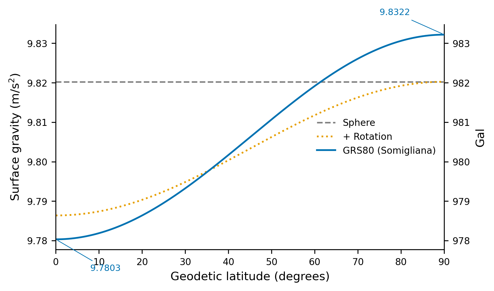
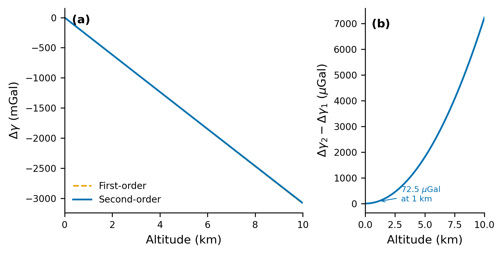

# Section 3: Gravity on a Quiet Earth (Normal Gravity)

Before introducing lunar and solar perturbations, we need the "quiet Earth" baseline: **normal gravity** $\gamma(\varphi, h)$, accounting for Earth's mass, rotation, and shape. We build this from scratch, adding one physical effect at a time.

---

## 3.1 The non-rotating spherical case

By the shell theorem, a radially symmetric Earth of mass $M_E$ produces a surface gravitational acceleration

$$g = \frac{G M_E}{R^2}$$

independent of the test mass.

**Numerical check.** Geodesists use the product $GM_E = 3.986\,004\,418 \times 10^{14}$ m$^3$ s$^{-2}$ (known to 10 significant figures from satellite tracking) rather than $G$ and $M_E$ individually. With mean radius $R = 6.371 \times 10^6$ m:

$$g = \frac{3.986 \times 10^{14}}{(6.371 \times 10^6)^2} = \frac{3.986 \times 10^{14}}{4.059 \times 10^{13}} \approx 9.82 \text{ m/s}^2$$

This is ~0.2% from the standard value of $9.81$ m/s$^2$. The discrepancy arises because Earth is neither spherical nor non-rotating.

---

## 3.2 Why rotation matters

An observer on Earth's surface occupies a non-inertial rotating frame, giving rise to a centrifugal acceleration.

### The centrifugal acceleration

At geodetic latitude $\varphi$ on a spherical Earth of radius $R$, the distance from the rotation axis is $R_\perp = R \cos\varphi$, yielding

$$a_\text{cen} = \Omega^2 R \cos\varphi$$

where $\Omega = 7.292\,115 \times 10^{-5}$ rad/s.

**Magnitude.** At the equator ($\varphi = 0$), using $R_\text{eq} = 6{,}378{,}137$ m:

$$a_\text{cen}^{\max} = \Omega^2 R_\text{eq} = 5.317 \times 10^{-9} \times 6.378 \times 10^6 \approx 0.0339 \text{ m/s}^2$$

This is $\sim 0.34\%$ of $g$ — it appears in the fourth significant figure of any gravimeter reading. At the poles, $\cos\varphi = 0$ and the centrifugal term vanishes.

### Effective gravity

Gravitational acceleration $\mathbf{g}_\text{grav}$ points radially inward; centrifugal acceleration $\mathbf{a}_\text{cen}$ points perpendicular to the rotation axis. The measured gravity is their vector sum:

$$\mathbf{g}_\text{eff} = \mathbf{g}_\text{grav} + \mathbf{a}_\text{cen}$$

Projecting the centrifugal term onto the radial direction gives

$$g_\text{eff}(\varphi) \approx \frac{GM_E}{R^2} - \Omega^2 R \cos^2\!\varphi$$

A small tangential component $\frac{1}{2}\Omega^2 R \sin 2\varphi$ deflects the local vertical equatorward, but this second-order geometric effect is absorbed into the ellipsoidal treatment below.

**Summary of rotation effects:**
- Equator: gravity reduced by $\sim 0.034$ m/s$^2$ ($\sim 0.3\%$)
- Poles: no reduction
- Mid-latitudes: intermediate, scaling as $\cos^2\!\varphi$

---

## 3.3 Why shape matters

Centrifugal deformation over geological time has shaped the Earth into an **oblate ellipsoid**, quantified by the flattening

$$f = \frac{a - b}{a}$$

where $a$ and $b$ are the equatorial and polar semi-axes. For the GRS80 reference ellipsoid:

$$f = \frac{1}{298.257} \qquad \Longrightarrow \qquad a - b \approx 21.4 \text{ km}$$

with $a = 6{,}378{,}137$ m and $b \approx 6{,}356{,}752$ m (a 0.3% radial difference). This affects gravity through two competing mechanisms:

1. **Distance effect.** An equatorial observer is ~21 km farther from Earth's center than a polar observer. From the $1/r^2$ law, this weakens equatorial gravity by $\sim 2 \times 21/6371 \approx 0.7\%$.

2. **Mass distribution effect.** The equatorial bulge places more mass near the equatorial plane, partially compensating the distance effect for equatorial observers and slightly reducing polar gravity.

The combined shape and rotation effects produce a pole-to-equator gravity variation of ~0.05 m/s$^2$ (~0.5%) — a thousand times larger than the tidal signals modeled in later sections, making an accurate baseline essential.

---

## 3.4 Somigliana's formula

Computing gravity on a rotating oblate ellipsoid requires solving for the gravitational potential of an ellipsoidal mass distribution (Clairaut's problem). We state the closed-form result.

### The level ellipsoid

The **GRS80 reference ellipsoid** is an equipotential surface (gravitational + centrifugal) defined by four parameters:
- $a = 6{,}378{,}137$ m (equatorial semi-major axis)
- $GM_E = 3.986\,004\,418 \times 10^{14}$ m$^3$ s$^{-2}$ (gravitational parameter)
- $J_2 = 1.082\,63 \times 10^{-3}$ (dynamic form factor)
- $\Omega = 7.292\,115 \times 10^{-5}$ rad/s (angular velocity)

All derived quantities ($b$, $f$, surface gravity values) follow from these four.

### The formula

**Somigliana's formula** (1929) gives gravity on the level ellipsoid as a function of geodetic latitude $\varphi$:

$$\gamma_0(\varphi) = \frac{\gamma_e \left(1 + k \sin^2\!\varphi\right)}{\sqrt{1 - e^2 \sin^2\!\varphi}}$$

where:

| Symbol | Meaning | GRS80 Value |
|--------|---------|-------------|
| $\gamma_e$ | Gravity at the equator | $9.780\,325\,3141\;\mathrm{m/s^2}$ |
| $\gamma_p$ | Gravity at the pole | $9.832\,184\,9378\;\mathrm{m/s^2}$ |
| $k$ | Somigliana constant | $(b\,\gamma_p)/(a\,\gamma_e) - 1$ |
| $e^2$ | First eccentricity squared | $2f - f^2$ |

**The denominator** $\sqrt{1 - e^2 \sin^2\!\varphi}$: With $e^2 \approx 0.00669$, this factor ranges from 1 (equator) to $b/a \approx 0.99665$ (pole). It accounts for the varying orientation of the surface normal on the ellipsoid, slightly amplifying gravity at higher latitudes.

**The numerator factor** $1 + k \sin^2\!\varphi$: The Somigliana constant

$$k = \frac{b \cdot \gamma_p}{a \cdot \gamma_e} - 1 \approx 0.001\,932$$

encodes the fractional polar–equatorial gravity difference, corrected by the geometric factor. One verifies that $\gamma_0(0°) = \gamma_e$ and $\gamma_0(90°) = \gamma_p$: at the pole, the numerator becomes $\gamma_e(1+k)$ and the denominator becomes $b/a$; using the definition of $k$, these combine to give $\gamma_p$.

**Quick check at 45° latitude:**

$$\sin^2(45°) = 0.5$$

$$\gamma_0(45°) = \frac{9.780\,325 \times (1 + 0.001\,932 \times 0.5)}{\sqrt{1 - 0.006\,694 \times 0.5}} = \frac{9.780\,325 \times 1.000\,966}{\sqrt{0.996\,653}}$$

$$= \frac{9.789\,776}{0.998\,325} \approx 9.806\,2 \text{ m/s}^2$$

This matches the commonly quoted mid-latitude value.

**Figure 4** shows normal gravity from equator to pole for three models: constant spherical, sphere-plus-rotation, and full GRS80 Somigliana. Rotation accounts for most of the latitude variation; the ellipsoidal shape provides an additional refinement.

---

## 3.5 Free-air correction (going up)

Somigliana's formula gives gravity *on* the ellipsoid ($h = 0$). Real instruments operate at some height $h$ above it, so we need the altitude dependence.

### Taylor expansion in $h/a$

Expanding gravity at height $h$:

$$\gamma(\varphi, h) = \gamma_0(\varphi) \left[1 + c_1 \frac{h}{a} + c_2 \left(\frac{h}{a}\right)^2 + \cdots\right]$$

### First-order coefficient

For a non-rotating sphere, $g(r) = GM_E/r^2$ gives $\partial g/\partial r = -2g/r$, so $c_1 = -2$.

On a rotating oblate ellipsoid, the exact first-order coefficient is

$$c_1 = -2\left(1 + f + m - 2f\sin^2\!\varphi\right)$$

where $m$ is the **geodetic ratio** of centrifugal to gravitational acceleration at the equator:

$$m = \frac{\Omega^2 a^2 b}{GM_E} \approx 0.003\,449$$

The corrections beyond $-2$ have clear physical origins:
- $f \approx 0.003\,353$: ellipsoidal geometry modifies the effective radius entering the gradient.
- $m \approx 0.003\,449$: centrifugal acceleration itself varies with height.
- $-2f\sin^2\!\varphi$: latitude dependence from varying local radius of curvature.

**Numerical magnitude.** At the equator ($\sin^2\!\varphi = 0$):

$$c_1 = -2(1 + 0.003\,353 + 0.003\,449) = -2.013\,6$$

The gravity gradient at the surface is

$$\frac{\partial \gamma}{\partial h}\bigg|_{h=0} \approx -\frac{2 \times 9.780 \times 1.007}{6{,}378{,}137} \approx -3.086 \times 10^{-6} \text{ m/s}^2\text{/m}$$

or $-0.3086$ mGal/m — the well-known **free-air gradient** (1 mGal $= 10^{-5}$ m/s$^2$).

### Second-order coefficient

Continuing the binomial expansion $(1+h/a)^{-2} = 1 - 2(h/a) + 3(h/a)^2 - \cdots$ gives $c_2 = +3$. Ellipsoidal corrections to this coefficient are at the sub-percent level of an already small term; Pytheas uses $c_2 = 3$, which is adequate to several kilometers altitude.

### The complete formula

$$\boxed{\gamma(\varphi, h) = \gamma_0(\varphi) \left[1 - \frac{2\left(1 + f + m - 2f\sin^2\!\varphi\right)}{a}\,h + \frac{3\,h^2}{a^2}\right]}$$

where $\gamma_0(\varphi)$ is Somigliana's formula from Section 3.4. This is a standard result in physical geodesy (cf. Torge & Muller, *Geodesy*, 4th ed.; Hofmann-Wellenhof & Moritz, *Physical Geodesy*), exact to second order in $h/a$ on the level ellipsoid.

**Figure 5** illustrates the free-air correction versus altitude. Panel (b) highlights how the second-order term becomes significant above a few hundred meters.

### Why the second-order term matters

**At $h = 100$ m:**

$$3\gamma_0 \frac{h^2}{a^2} \approx 3 \times 9.8 \times 2.5 \times 10^{-10} \approx 0.73 \text{ }\mu\text{Gal}$$

Below the $\sim 1\,\mu$Gal precision target — barely relevant.

**At $h = 1{,}000$ m:**

$$3\gamma_0 \frac{h^2}{a^2} \approx 3 \times 9.8 \times 2.5 \times 10^{-8} \approx 73 \text{ }\mu\text{Gal}$$

Omitting the quadratic term at 1 km altitude introduces a $73\,\mu$Gal error — far too large for precision gravimetry. Even at 500 m the error is $\sim 18\,\mu$Gal. The second-order term is essential for any site significantly above sea level.

### Numerical example: gravity in Munich

Latitude $48.1°$ N, altitude 520 m above the ellipsoid.

**Step 1: Somigliana on the ellipsoid.**

$$\sin^2(48.1°) \approx 0.5540$$

$$\gamma_0 = \frac{9.780\,325 \times (1 + 0.001\,932 \times 0.5540)}{\sqrt{1 - 0.006\,694 \times 0.5540}}$$

$$= \frac{9.780\,325 \times 1.001\,070}{\sqrt{0.996\,292}} = \frac{9.790\,792}{0.998\,145} \approx 9.809\,0 \text{ m/s}^2$$

**Step 2: Free-air correction.**

$$\text{fac} = 1 + 0.003\,353 + 0.003\,449 - 2 \times 0.003\,353 \times 0.5540 = 1.003\,087$$

First-order term:
$$-\frac{2 \times 1.003\,087 \times 520}{6{,}378{,}137} = -1.633 \times 10^{-4}$$

Second-order term:
$$\frac{3 \times 520^2}{(6{,}378{,}137)^2} = \frac{811{,}200}{4.068 \times 10^{13}} = 1.994 \times 10^{-8}$$

$$\gamma(48.1°, 520) \approx 9.809\,0 \times (1 - 1.633 \times 10^{-4} + 1.994 \times 10^{-8})$$

$$\approx 9.809\,0 \times 0.999\,837 \approx 9.807\,4 \text{ m/s}^2$$

The free-air correction reduced gravity by ~160 mGal; the second-order term contributed ~20 $\mu$Gal — small at this altitude, but growing rapidly at higher elevations.

---

### Summary

| Model | Formula | Accuracy |
|-------|---------|----------|
| Spherical, non-rotating | $g = GM_E / R^2$ | ${\sim}\,0.5\%$ |
| + rotation | $g_\text{eff} = GM_E/R^2 - \Omega^2 R \cos^2\!\varphi$ | ${\sim}\,0.2\%$ |
| + shape (Somigliana) | $\gamma_0(\varphi)$ on ellipsoid | exact on surface |
| + altitude (free-air) | $\gamma(\varphi, h)$ with $h/a$ and $h^2/a^2$ terms | ${<}\,1\;\mu\mathrm{Gal}$ to ${\sim}\,1\;\mathrm{km}$ |

Starting from a single number ($9.82$ m/s$^2$), we now have a formula giving gravity to sub-microGal accuracy anywhere on or near Earth's surface — precision better than one part in $10^{10}$. This static baseline is the foundation onto which tidal perturbations (Section 4) will be superimposed.
