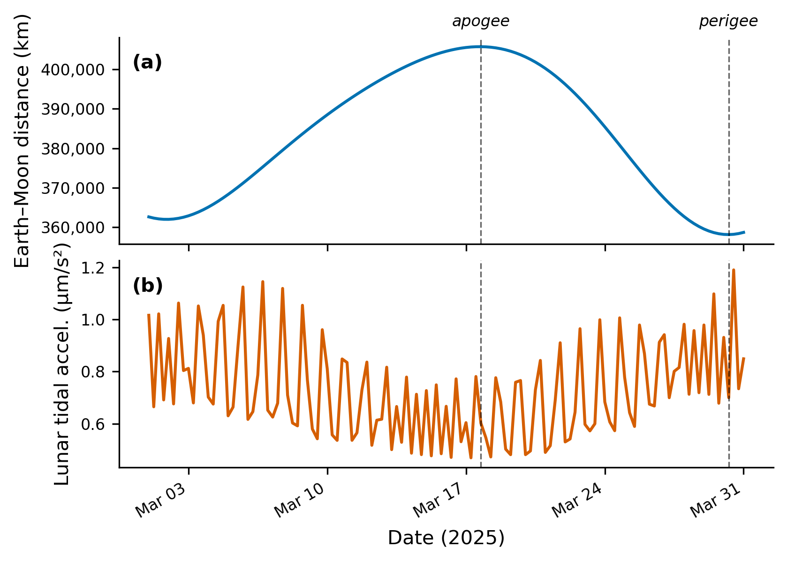
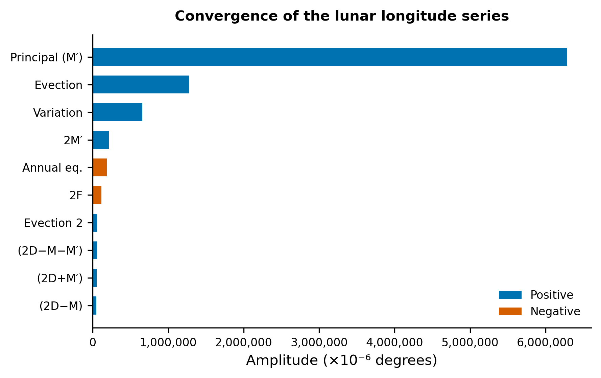

# Section 4: Where is the Moon? (Lunar Ephemeris)

To compute the tidal acceleration at any point on Earth we need, at every instant, a precise answer to a deceptively simple question: *where is the Moon?*  This section derives, from first principles, the analytical lunar ephemeris that Pytheas uses to answer it.

---

## 4.1 Why We Need to Know

Recall from Section 3 the tidal acceleration formula.  The gravitational acceleration that the Moon exerts at a point $\mathbf{r}$ on Earth's surface is

$$
\mathbf{a}_{\text{tidal}} = GM_{\text{Moon}} \left[ \frac{\mathbf{R} - \mathbf{r}}{|\mathbf{R} - \mathbf{r}|^3} - \frac{\mathbf{R}}{|\mathbf{R}|^3} \right],
$$

where $\mathbf{R}$ is the Moon's geocentric position vector.  Two things about this formula make the Moon's position critically important:

**Direction matters.**  The tidal acceleration is a *vector* quantity.  It points in a direction that depends on the Moon's angular position in the sky.  Move the Moon by a degree and the direction of the tidal pull on your gravimeter changes measurably.

**Distance matters even more.**  The tidal acceleration scales as

$$
a_{\text{tidal}} \propto \frac{GM}{R^3}.
$$

This is an *inverse-cube* law, not inverse-square.  A 1% change in distance produces a 3% change in tidal acceleration.  The Moon's distance from Earth varies substantially:

| Quantity | Value |
|----------|-------|
| Mean distance | 385,001 km |
| Perigee (closest) | ~356,500 km |
| Apogee (farthest) | ~406,700 km |
| Eccentricity | ~0.055 |

The ratio of apogee to perigee distances is about 1.14, which means the ratio of tidal forces at perigee versus apogee is $(406{,}700 / 356{,}500)^3 \approx 1.48$ -- the tidal pull is nearly 50% stronger at perigee than at apogee.  For a gravimeter measuring at the nGal level, getting the Moon's distance wrong by even a few hundred kilometres produces errors larger than our target accuracy.  Figure 6 shows the tight correlation between lunar distance variations over a synodic month and the resulting tidal acceleration amplitude -- the anti-correlation is clear: when the Moon is closest (perigee), the tidal acceleration is strongest, and vice versa at apogee.



In short: we need the Moon's position (all three coordinates -- longitude, latitude, distance) to high precision at every moment.

---

## 4.2 Keplerian Orbits in 5 Minutes

Before diving into the Moon's complicated real orbit, let us recall how orbits work in the simplest case: two bodies, no perturbations, just Newton's law of gravitation.

### The shape of an orbit

Consider a small body (the Moon) orbiting a massive body (the Earth) under gravity alone.  Newton showed that the orbit is a *conic section*.  For a bound orbit, this is an **ellipse** with the Earth at one focus.

An ellipse is described by two numbers:
- **Semi-major axis** $a$: half the longest diameter.  This sets the overall size of the orbit.
- **Eccentricity** $e$: how "squished" the ellipse is.  $e = 0$ is a circle; $e$ close to 1 is a very elongated ellipse.  For the Moon, $e \approx 0.055$ -- a nearly circular orbit with a slight elongation.

The closest point to Earth is called **perigee** (distance $a(1-e)$) and the farthest is **apogee** (distance $a(1+e)$).

### The six orbital elements

To completely specify an orbit in three-dimensional space, we need six numbers.  These are the **Keplerian orbital elements**:

1. **$a$ (semi-major axis):** The size of the orbit.
2. **$e$ (eccentricity):** The shape of the orbit.
3. **$i$ (inclination):** The tilt of the orbital plane relative to a reference plane (for the Moon, relative to the ecliptic -- the plane of Earth's orbit around the Sun).  The Moon's inclination is about 5.14 degrees.
4. **$\Omega$ (longitude of the ascending node):** Where the orbital plane intersects the reference plane.  Think of it as a compass heading: if you stand at the centre of the Earth and look along the line where the Moon's orbit crosses the ecliptic heading northward, $\Omega$ tells you which direction you are looking.
5. **$\omega$ (argument of periapsis):** The angle, measured in the orbital plane, from the ascending node to the perigee point.  This orients the ellipse within the orbital plane.
6. **$M$ (mean anomaly):** A time-keeping angle that tells you *where on the ellipse* the body currently is.

### Mean anomaly, eccentric anomaly, true anomaly

The mean anomaly $M$ increases uniformly with time:

$$
M = M_0 + n(t - t_0),
$$

where $n = 2\pi/P$ is the **mean motion** ($P$ = orbital period) and $t_0$ is a reference epoch.  $M$ is the angle that *would* describe the Moon's position if it moved at constant angular speed.  But on an ellipse, the Moon moves faster near perigee and slower near apogee (Kepler's second law), so $M$ does not directly give the position.

The actual angular position is described by the **true anomaly** $\nu$, the angle measured at the Earth's focus between the perigee direction and the Moon's current direction.  To get $\nu$ from $M$, we go through an intermediate quantity called the **eccentric anomaly** $E$, defined by **Kepler's equation**:

$$
M = E - e \sin E.
$$

This equation is transcendental -- there is no closed-form solution for $E$ in terms of $M$.  In practice, it is solved iteratively.  Once $E$ is known, the true anomaly follows from

$$
\tan\frac{\nu}{2} = \sqrt{\frac{1+e}{1-e}} \tan\frac{E}{2}.
$$

And the distance from the focus is

$$
r = a(1 - e\cos E).
$$

If Earth and Moon were alone in the universe, this would be the complete story.  We would specify the six orbital elements once, solve Kepler's equation at each time, and know where the Moon is forever.

---

## 4.3 Why the Moon Is Hard

### The three-body problem

The Moon does not orbit Earth in isolation.  The Sun is always there, tugging on the Moon with a force that, while weaker than Earth's gravitational pull, is far from negligible.

This makes the Moon's motion a **three-body problem**: Earth, Moon, and Sun all attract each other simultaneously.  And here we run into one of the deepest results in classical mechanics:

> **The general three-body problem has no closed-form solution.**

This was suspected by Newton and proven rigorously by Poincare in the 1890s.  There is no formula you can write down that gives the Moon's position for all time in terms of elementary functions.

### What the Sun does to the Moon's orbit

Even though we cannot write a closed-form solution, we can describe the qualitative effects of the Sun's perturbation.  They are dramatic:

**Apsidal precession.**  The line connecting perigee and apogee (the **line of apsides**) slowly rotates in the same direction as the Moon's orbital motion.  It completes a full revolution in about **8.85 years**.  In a pure Keplerian orbit, this line would be fixed forever.

**Nodal regression.**  The line of nodes -- where the Moon's orbital plane intersects the ecliptic -- rotates *backwards* (opposite to the Moon's motion), completing a full cycle in about **18.61 years**.  This is the famous *lunar nodal cycle* that modulates tidal amplitudes on Earth.

**Eccentricity oscillation.**  The Moon's orbital eccentricity is not constant but oscillates, driven by the Sun's pull.  It varies between roughly 0.044 and 0.067.

**Inclination oscillation.**  Similarly, the inclination of the Moon's orbit to the ecliptic oscillates between about 4.98 degrees and 5.30 degrees, correlated with the nodal regression.

### Newton's headache

Newton himself spent enormous effort trying to derive the Moon's motion from his theory of gravitation.  In a famous remark, he told the astronomer John Machin that "his head never ached but with his studies on the Moon."  The lunar theory occupied some of the greatest mathematical minds of the 18th and 19th centuries -- Euler, Clairaut, d'Alembert, Laplace, Hansen, Delaunay, Hill, and Brown all contributed major advances.

The difficulty is not just academic.  For centuries, accurate prediction of the Moon's position was a practical necessity for navigation at sea (the "longitude problem").  The quest to solve the lunar problem was one of the driving forces of mathematical physics.

---

## 4.4 The Meeus Approach

### Analytical perturbation theory

Since we cannot solve the three-body problem exactly, how do we predict the Moon's position?  There are two approaches:

1. **Numerical integration:** Integrate Newton's equations of motion step by step on a computer.  This is what JPL does for their Development Ephemerides (DE430, DE440).  It is extremely accurate but requires large data files and careful numerical methods.

2. **Analytical perturbation series:** Start with the Keplerian solution and add correction terms (perturbations) caused by the Sun, expressed as trigonometric series.  Fit the coefficients to centuries of observations.  The result is a formula -- long, but a formula -- that you can evaluate at any time.

Pytheas uses the second approach, following the compilation by **Jean Meeus** in his book *Astronomical Algorithms* (Chapter 47).  Meeus distilled the essential terms from the high-precision ELP-2000 lunar theory of Chapront-Touze and Chapront, keeping enough terms for sub-arcminute accuracy in position and ~200 km accuracy in distance.

The key idea is this: the Moon's ecliptic longitude, latitude, and distance can each be expressed as a sum of sinusoidal terms, where the arguments of each sinusoid are integer combinations of five fundamental angles.

### The five fundamental arguments

The five angles that parameterize the Moon's position are all functions of time.  Each has a clear physical meaning:

**$L'$ -- Moon's mean longitude.**  This is where the Moon would be if it moved along the ecliptic at a perfectly uniform rate.  It is the "clock" of the Moon's mean orbital motion.

$$
L' = 218.3164477^\circ + 481{,}267.88123421^\circ\, T - 0.0015786^\circ\, T^2 + \frac{T^3}{538{,}841}
$$

The large linear coefficient (481,268 degrees per century, or about 13.18 degrees per day) reflects the Moon's roughly 27.3-day orbital period.

**$D$ -- Mean elongation.**  The angular separation between the Moon and the Sun, averaged over short-period oscillations.  When $D = 0$, the Moon is in the direction of the Sun (new moon); when $D = 180°$, the Moon is opposite the Sun (full moon).

$$
D = 297.8501921^\circ + 445{,}267.1114034^\circ\, T - 0.0018819^\circ\, T^2 + \frac{T^3}{545{,}868}
$$

The linear rate of $D$ is the difference between the Moon's mean motion and the Sun's -- about 12.19 degrees per day, reflecting the synodic month (new moon to new moon) of ~29.53 days.

**$M$ -- Sun's mean anomaly.**  The position of the Sun on its (slightly) elliptical orbit around the Earth (or equivalently, Earth around the Sun).  $M = 0$ at perihelion.

$$
M = 357.5291092^\circ + 35{,}999.0502909^\circ\, T - 0.0001536^\circ\, T^2
$$

The linear rate (~35,999 degrees/century = ~0.986 degrees/day) corresponds to the Earth's orbital period of ~365.25 days.

**$M'$ -- Moon's mean anomaly.**  The position of the Moon on its elliptical orbit.  $M' = 0$ at perigee.  This is the angle that would give the Moon's position if the orbit were a fixed, unperturbed ellipse.

$$
M' = 134.9633964^\circ + 477{,}198.8675055^\circ\, T + 0.0087414^\circ\, T^2 + \frac{T^3}{69{,}699}
$$

The linear rate (~477,199 degrees/century) corresponds to the anomalistic month (perigee to perigee) of ~27.55 days, which differs from the sidereal month because of apsidal precession.

**$F$ -- Moon's argument of latitude.**  The Moon's angular distance from the ascending node of its orbit on the ecliptic.  This angle determines how far above or below the ecliptic the Moon sits.

$$
F = 93.2720950^\circ + 483{,}202.0175233^\circ\, T - 0.0036539^\circ\, T^2 - \frac{T^3}{3{,}526{,}000}
$$

The linear rate (~483,202 degrees/century) corresponds to the draconic month (node to node) of ~27.21 days, shorter than the sidereal month because of nodal regression.

In all of these, $T$ is **Julian centuries since J2000.0** (noon on January 1, 2000, TT):

$$
T = \frac{JD - 2{,}451{,}545.0}{36{,}525}.
$$

The key observation is that the five fundamental arguments have *different periods*.  $L'$ tracks the Moon's average position; $D$ tracks its phase relative to the Sun; $M$ tracks Earth's orbital position; $M'$ tracks the Moon's position on its own ellipse; and $F$ tracks latitude oscillations.  Every perturbation of the Moon's motion can be decomposed into sinusoids whose arguments are integer linear combinations of these five angles.

### The perturbation series structure

The Moon's ecliptic coordinates are computed as perturbations about the mean values:

**Ecliptic longitude** (the Moon's east-west position on the sky):

$$
\lambda = L' + \frac{1}{10^6} \sum_i a_i \sin(n_1^{(i)} D + n_2^{(i)} M + n_3^{(i)} M' + n_4^{(i)} F)
$$

where $\lambda$ is in degrees, each $a_i$ is a coefficient in units of $10^{-6}$ degrees, and the $n_k^{(i)}$ are small integers (typically $-4$ to $+4$).

**Ecliptic latitude** (how far above or below the ecliptic):

$$
\beta = \frac{1}{10^6} \sum_j c_j \sin(n_1^{(j)} D + n_2^{(j)} M + n_3^{(j)} M' + n_4^{(j)} F)
$$

Note: the latitude has no "mean" term added because the Moon's mean position is *on* the ecliptic; it oscillates above and below.

**Distance** from Earth's centre:

$$
\Delta = 385{,}000.56 \text{ km} + \frac{1}{1000} \sum_k b_k \cos(n_1^{(k)} D + n_2^{(k)} M + n_3^{(k)} M' + n_4^{(k)} F)
$$

where each $b_k$ is in meters.  Note the cosine (not sine) for distance -- the distance is largest and smallest when the Moon's anomaly-related arguments are at extremes, which are cosine maxima and minima.

Pytheas uses **24 terms** for longitude, **23 terms** for distance, and **18 terms** for latitude.  These are the dominant terms from Meeus's compilation of the ELP-2000 theory.

### The biggest terms and what they mean

The convergence of these series is best understood by examining the largest terms.  Here are the top five in each series, along with their physical origin.

#### Longitude terms (units: $10^{-6}$ degrees)

| # | $n_D$ | $n_M$ | $n_{M'}$ | $n_F$ | Coefficient $a_i$ | Amplitude | Name / Physical origin |
|---|-------|-------|----------|-------|-------------------|-----------|----------------------|
| 1 | 0 | 0 | 1 | 0 | +6,288,774 | 6.289° | **Equation of the centre**: the Moon's elliptical motion.  The Moon moves faster at perigee and slower at apogee; this sinusoidal correction accounts for that. |
| 2 | 2 | 0 | $-1$ | 0 | +1,274,027 | 1.274° | **Evection**: the Sun distorts the Moon's orbital eccentricity.  The effective eccentricity is larger when the Moon's apsidal line aligns with the Sun, and smaller when perpendicular.  Discovered by Ptolemy (~2nd century). |
| 3 | 2 | 0 | 0 | 0 | +658,314 | 0.658° | **Variation**: the Moon speeds up when between Earth and Sun (new/full moon) and slows down at quadrature (first/third quarter).  Discovered by Tycho Brahe (~1590). |
| 4 | 0 | 0 | 2 | 0 | +213,618 | 0.214° | Second harmonic of the equation of the centre: correction from the next term in the eccentricity expansion. |
| 5 | 0 | 1 | 0 | 0 | $-185,116$ | 0.185° | **Annual equation**: Earth's elliptical orbit means the Sun's perturbing force varies over the year.  The Moon runs slightly ahead of its mean position when Earth is farther from the Sun (around aphelion), and slightly behind when closer. |

Notice the rapid convergence: the largest term (6.29°) is about 5 times bigger than the second (1.27°), which is about twice the third (0.66°).  By the 24th term (coefficient 4,036), we are down to corrections of 0.004° -- about 14 arcseconds.

#### Distance terms (units: meters)

| # | $n_D$ | $n_M$ | $n_{M'}$ | $n_F$ | Coefficient $b_k$ | Distance | Physical origin |
|---|-------|-------|----------|-------|-------------------|----------|----------------|
| 1 | 0 | 0 | 1 | 0 | $-20,905,355$ | 20,905 km | Equation of the centre: the Moon's elliptical orbit makes it closer at perigee, farther at apogee. |
| 2 | 2 | 0 | $-1$ | 0 | $-3,699,111$ | 3,699 km | Evection in distance. |
| 3 | 2 | 0 | 0 | 0 | $-2,955,968$ | 2,956 km | Variation in distance. |
| 4 | 0 | 0 | 2 | 0 | $-569,925$ | 570 km | Second eccentricity harmonic. |
| 5 | 2 | 0 | $-2$ | 0 | +246,158 | 246 km | Mixed term. |

The dominant distance variation of ~20,900 km is consistent with the mean distance (385,001 km) times the eccentricity ($385{,}001 \times 0.055 \approx 21{,}175$ km).

#### Latitude terms (units: $10^{-6}$ degrees)

| # | $n_D$ | $n_M$ | $n_{M'}$ | $n_F$ | Coefficient $c_j$ | Amplitude | Physical origin |
|---|-------|-------|----------|-------|-------------------|-----------|----------------|
| 1 | 0 | 0 | 0 | 1 | +5,128,122 | 5.128° | **Inclination term**: the Moon's orbit is tilted ~5.14° to the ecliptic, so it oscillates above and below by this amount each orbit. |
| 2 | 0 | 0 | 1 | 1 | +280,602 | 0.281° | Coupling between eccentricity and inclination. |
| 3 | 0 | 0 | 1 | $-1$ | +277,693 | 0.278° | Same coupling, opposite node crossing. |
| 4 | 2 | 0 | 0 | $-1$ | +173,237 | 0.173° | Solar perturbation of latitude. |
| 5 | 2 | 0 | $-1$ | 1 | +55,413 | 0.055° | Evection in latitude. |

The dominant latitude term (5.13°) is essentially the Moon's orbital inclination.  All other terms are corrections to this basic north-south oscillation.

Figure 7 ranks the largest longitude perturbation terms by amplitude, illustrating how the series converges -- the first few terms capture the dominant physics (the equation of the centre, evection, and variation), while the long tail of smaller corrections refines the result to sub-arcminute accuracy.



### The eccentricity correction $E$

There is a subtlety in evaluating the series.  Terms that involve the Sun's mean anomaly $M$ (those with $n_2 \neq 0$) must be corrected for the slow change in the eccentricity of Earth's orbit around the Sun.  The correction factor is

$$
E = 1 - 0.002516\, T - 0.0000074\, T^2.
$$

Each coefficient $a_i$, $b_k$, or $c_j$ is multiplied by $E^{|n_2|}$ -- that is, by $E$ if $|n_2| = 1$ and by $E^2$ if $|n_2| = 2$.  Terms with $n_2 = 0$ are unaffected.

Physically, this correction accounts for the fact that Earth's orbit is slowly becoming more circular (its eccentricity is currently decreasing at about 0.00004 per century).  The Sun's perturbing effect on the Moon depends on how elliptical Earth's orbit is, so terms involving the Sun's anomaly must be scaled accordingly.

In Pytheas, this is implemented as:

```python
E = 1.0 - 0.002516 * T - 0.0000074 * T ** 2

def _sum_series(terms, use_cos=False):
    total = 0.0
    for d, ms, mp, f, coeff in terms:
        arg = d * D_r + ms * Ms_r + mp * Mp_r + f * F_r
        e_corr = E ** abs(ms)      # <-- eccentricity correction
        if use_cos:
            total += coeff * e_corr * np.cos(arg)
        else:
            total += coeff * e_corr * np.sin(arg)
    return total
```

### Additional corrections: $A_1$, $A_2$, $A_3$

Beyond the main perturbation series, Meeus includes three small additive corrections:

$$
A_1 = 119.75^\circ + 131.849^\circ\, T
$$
$$
A_2 = 53.09^\circ + 479{,}264.290^\circ\, T
$$
$$
A_3 = 313.45^\circ + 481{,}266.484^\circ\, T
$$

These correct for effects not captured by the five fundamental arguments alone:

- **$A_1$ correction to longitude** ($+3958 \sin A_1$): accounts for the perturbation of the Moon by **Venus**.  Venus is the brightest planet for a reason -- it gets close to Earth, and its gravitational tug on the Moon, while tiny, is detectable.

- **$A_2$ correction to longitude** ($+318 \sin A_2$): a further Venus-related correction to the Moon's longitude.

- **Correction $+1962 \sin(L' - F)$ to longitude**: accounts for the effect of Earth's **oblateness** (equatorial bulge) on the Moon's longitude.  The Earth is not a perfect sphere, and the extra mass around the equator perturbs the Moon's motion.

- **$A_3$ correction to latitude** ($+382 \sin A_3$): Venus perturbation of the Moon's latitude.

- **Further latitude corrections**: terms like $-2235 \sin L'$, $+175 \sin(A_1 \pm F)$, $+127 \sin(L' - M')$, and $-115 \sin(L' + M')$ fine-tune the latitude computation.

In Pytheas:

```python
A1 = np.radians((119.75 + 131.849 * T) % 360)
A2 = np.radians((53.09 + 479264.290 * T) % 360)
A3 = np.radians((313.45 + 481266.484 * T) % 360)

sum_l += 3958 * np.sin(A1) + 1962 * np.sin(Lp_r - F_r) + 318 * np.sin(A2)
sum_b += (-2235 * np.sin(Lp_r) + 382 * np.sin(A3)
          + 175 * np.sin(A1 - F_r) + 175 * np.sin(A1 + F_r)
          + 127 * np.sin(Lp_r - Mp_r) - 115 * np.sin(Lp_r + Mp_r))
```

### Assembling the final coordinates

After evaluating the series, the Moon's ecliptic coordinates are:

$$
\lambda = L' + \frac{\Sigma_l}{10^6} \quad (\text{degrees}), \qquad
\beta = \frac{\Sigma_b}{10^6} \quad (\text{degrees}), \qquad
\Delta = 385{,}000.56 + \frac{\Sigma_r}{1000} \quad (\text{km}).
$$

Here $\Sigma_l$, $\Sigma_b$, $\Sigma_r$ are the evaluated sums (with eccentricity corrections and the additional $A_1, A_2, A_3$ terms included).

---

## 4.5 From Ecliptic to Your Location

The perturbation series gives the Moon's position in **ecliptic coordinates** $(\lambda, \beta, \Delta)$: longitude and latitude measured relative to the plane of Earth's orbit, plus the distance.  But our tidal acceleration formula needs the Moon's position in the same coordinate system as the observer -- **ECEF (Earth-Centred, Earth-Fixed)** Cartesian coordinates.  This requires two rotations.

### Step 1: Ecliptic to Equatorial (ECI)

The **ecliptic plane** (Earth's orbital plane) is tilted relative to the **equatorial plane** (Earth's equator extended into space) by an angle $\varepsilon$ called the **obliquity of the ecliptic**.  At the J2000.0 epoch:

$$
\varepsilon_0 = 23.439291^\circ.
$$

This angle changes slowly with time (due to precession and nutation):

$$
\varepsilon = \varepsilon_0 - 0.013004^\circ\, T,
$$

though for the precision of our lunar ephemeris, the linear correction suffices.

To convert from ecliptic to equatorial coordinates, we first express the Moon's position in Cartesian ecliptic coordinates:

$$
\begin{pmatrix} X_{\text{ecl}} \\ Y_{\text{ecl}} \\ Z_{\text{ecl}} \end{pmatrix}
= \Delta \begin{pmatrix} \cos\beta\,\cos\lambda \\ \cos\beta\,\sin\lambda \\ \sin\beta \end{pmatrix}.
$$

The ecliptic-to-equatorial transformation is a rotation about the $x$-axis (the direction of the vernal equinox, which is shared by both coordinate systems) by angle $\varepsilon$:

$$
R_x(\varepsilon) = \begin{pmatrix} 1 & 0 & 0 \\ 0 & \cos\varepsilon & -\sin\varepsilon \\ 0 & \sin\varepsilon & \cos\varepsilon \end{pmatrix}.
$$

The $x$-axis points toward the vernal equinox (where the Sun crosses the equator heading north).  The ecliptic and equatorial planes share this direction -- they differ only in how the $y$ and $z$ axes are tilted.  So we rotate around $x$:

$$
\begin{pmatrix} X_{\text{ECI}} \\ Y_{\text{ECI}} \\ Z_{\text{ECI}} \end{pmatrix}
= R_x(\varepsilon) \begin{pmatrix} X_{\text{ecl}} \\ Y_{\text{ecl}} \\ Z_{\text{ecl}} \end{pmatrix}.
$$

Writing this out component by component:

$$
X_{\text{ECI}} = \Delta\,\cos\beta\,\cos\lambda
$$

$$
Y_{\text{ECI}} = \Delta\left(\cos\beta\,\sin\lambda\,\cos\varepsilon - \sin\beta\,\sin\varepsilon\right)
$$

$$
Z_{\text{ECI}} = \Delta\left(\cos\beta\,\sin\lambda\,\sin\varepsilon + \sin\beta\,\cos\varepsilon\right)
$$

Let us verify the structure.  When $\beta = 0$ (Moon on the ecliptic) and $\lambda = 90°$ (Moon at the summer solstice direction):
- $X_{\text{ECI}} = 0$ (correct -- the Moon is perpendicular to the equinox direction)
- $Y_{\text{ECI}} = \Delta\cos\varepsilon$ (the Moon appears projected toward the equatorial $y$-axis, foreshortened by the obliquity)
- $Z_{\text{ECI}} = \Delta\sin\varepsilon$ (the Moon appears above the equatorial plane by $\varepsilon$)

This matches our geometric expectation.  The result is a position vector in the **Earth-Centred Inertial (ECI)** frame, with $x$ pointing toward the vernal equinox, $z$ pointing toward the celestial north pole, and $y$ completing a right-handed system.

In Pytheas, this is implemented as:

```python
eps = np.radians(OBLIQUITY_J2000 - 0.013004 * T)
cb, sb = np.cos(beta), np.sin(beta)
cl, sl = np.cos(lam),  np.sin(lam)
ce, se = np.cos(eps),  np.sin(eps)

x_eci = dist_m * cb * cl
y_eci = dist_m * (cb * sl * ce - sb * se)
z_eci = dist_m * (cb * sl * se + sb * ce)
```

### Step 2: ECI to ECEF

The ECI frame does not rotate with the Earth.  The **ECEF (Earth-Centred, Earth-Fixed)** frame does: its $x$-axis always points through the Greenwich meridian, and it rotates with the Earth at angular rate $\Omega$.

The angle between the ECI $x$-axis (vernal equinox) and the ECEF $x$-axis (Greenwich meridian) is the **Greenwich Mean Sidereal Time (GMST)**, which we derived in Section 2.  Denoting this angle $\theta_{\text{GMST}}$ (in radians), the transformation is a rotation about the $z$-axis:

$$
\begin{pmatrix} X_{\text{ECEF}} \\ Y_{\text{ECEF}} \\ Z_{\text{ECEF}} \end{pmatrix}
= R_z(\theta_{\text{GMST}}) \begin{pmatrix} X_{\text{ECI}} \\ Y_{\text{ECI}} \\ Z_{\text{ECI}} \end{pmatrix}
= \begin{pmatrix} \cos\theta & \sin\theta & 0 \\ -\sin\theta & \cos\theta & 0 \\ 0 & 0 & 1 \end{pmatrix}
\begin{pmatrix} X_{\text{ECI}} \\ Y_{\text{ECI}} \\ Z_{\text{ECI}} \end{pmatrix}.
$$

Note the sign convention: the Earth rotates eastward (counterclockwise as seen from the north pole), so to go from a non-rotating frame (ECI) to the co-rotating frame (ECEF), we rotate by $+\theta_{\text{GMST}}$ in the sense shown.  The matrix above corresponds to:

$$
X_{\text{ECEF}} = X_{\text{ECI}}\cos\theta + Y_{\text{ECI}}\sin\theta
$$
$$
Y_{\text{ECEF}} = -X_{\text{ECI}}\sin\theta + Y_{\text{ECI}}\cos\theta
$$
$$
Z_{\text{ECEF}} = Z_{\text{ECI}}
$$

The $z$-component is unchanged because we are rotating around the polar axis.

In Pytheas:

```python
def _eci_to_ecef(x_eci, y_eci, z_eci, dt):
    theta = gmst_rad(dt)
    c, s = np.cos(theta), np.sin(theta)
    return (c * x_eci + s * y_eci,
            -s * x_eci + c * y_eci,
            z_eci)
```

### The complete pipeline

Putting it all together, the computation of the Moon's ECEF position at time $t$ proceeds as follows:

1. **Compute $T$** from the Julian Date.
2. **Evaluate the five fundamental arguments** $L'$, $D$, $M$, $M'$, $F$ as polynomials in $T$.
3. **Compute the eccentricity correction** $E$.
4. **Sum the perturbation series** for longitude ($\Sigma_l$, 24 sine terms), distance ($\Sigma_r$, 23 cosine terms), and latitude ($\Sigma_b$, 18 sine terms), applying $E^{|n_2|}$ to each term.
5. **Apply the additional corrections** $A_1$, $A_2$, $A_3$.
6. **Assemble ecliptic coordinates**: $\lambda = L' + \Sigma_l/10^6$, $\beta = \Sigma_b/10^6$, $\Delta = 385{,}000.56 + \Sigma_r/1000$ km.
7. **Rotate ecliptic $\to$ equatorial (ECI)** using the obliquity $\varepsilon$.
8. **Rotate ECI $\to$ ECEF** using the GMST angle $\theta$.

The result is a position vector $\mathbf{R}_{\text{Moon}}$ in the same ECEF frame as the observer's position $\mathbf{r}$, ready to be plugged into the tidal acceleration formula from Section 3.

---

### Summary

The Moon's position cannot be computed from a simple Keplerian orbit because the Sun continuously perturbs the lunar trajectory.  Instead, we use an analytical perturbation series -- a sum of sinusoidal terms, each involving integer combinations of five fundamental angles that track different aspects of the Earth-Moon-Sun geometry.  The Meeus compilation provides a practical implementation: 24+23+18 = 65 terms that capture the Moon's ecliptic longitude, distance, and latitude to sub-arcminute accuracy.  Two rotations (ecliptic-to-equatorial, then ECI-to-ECEF) bring the result into the Earth-fixed coordinate system needed for tidal calculations.
