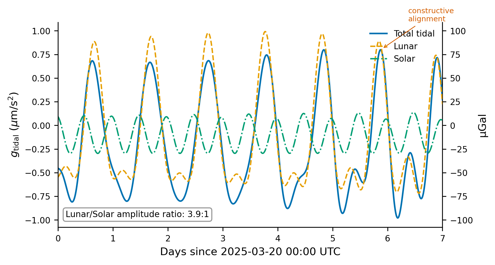

# Section 5: Solar Ephemeris

This section derives the low-precision solar ephemeris used in Pytheas and
shows that its errors are negligible for tidal gravimetry.

---

## 5.1 Why the Sun is easier

The Sun's apparent position as seen from Earth is governed by the *Earth's*
orbit around the Sun --- a nearly Keplerian two-body problem with only
minor planetary perturbations.  Three properties make a simple treatment
sufficient:

1. **No dominant perturber.**  Jupiter ($M_{\text{Jup}}/M_{\odot} \approx
   10^{-3}$, distance 4--5 AU) perturbs Earth's ecliptic longitude by only
   a few arcseconds per century.

2. **Small eccentricity.**  $e \approx 0.0167$, so the equation of center
   converges rapidly: three terms give sub-arcsecond accuracy.

3. **No inclination corrections.**  The ecliptic is the reference plane, so
   the Sun's ecliptic latitude is zero by definition (neglecting the ~1"
   barycentric offset).

For comparison, the Moon has $e \approx 0.055$ and is strongly perturbed by
the Sun --- a genuine three-body problem requiring 60+ correction terms.

---

## 5.2 Mean anomaly and the equation of center

### Mean longitude and mean anomaly

The Sun's mean longitude (polynomial in $T$, Julian centuries since J2000.0):

$$L_0 = 280.46646^\circ + 36000.76983^\circ T + 0.0003032^\circ T^2$$

The linear term gives ${\sim}0.9856^\circ$/day, i.e., one revolution per year.
The quadratic term captures secular drift from planetary perturbations.

The mean anomaly measures progress since perihelion on a fictitious circular orbit:

$$M = 357.52911^\circ + 35999.05029^\circ T - 0.0001536^\circ T^2$$

The difference $L_0 - M$ is the slowly drifting longitude of perihelion.

### Deriving the equation of center from Kepler's equation

#### Step 1: Kepler's equation

For an ellipse with semi-major axis $a$ and eccentricity $e$, the eccentric
anomaly $E$ satisfies:

$$E - e \sin E = M$$

No closed-form solution exists, but $e \approx 0.0167$ permits a series expansion.

#### Step 2: Series expansion of $E$ in powers of $e$

Set $E = M + \delta$. Substituting into Kepler's equation:

$$(M + \delta) - e \sin(M + \delta) = M$$

$$\delta = e \sin(M + \delta)$$

**First order** ($\delta \sim \mathcal{O}(e)$, set $\delta = 0$ in the argument):

$$\delta_1 = e \sin M$$

**Second order** (substitute $\delta_1$ back and expand):

$$\delta_2 = e \sin(M + e \sin M) \approx e\bigl[\sin M + e \sin M \cos M\bigr] = e \sin M + \tfrac{1}{2} e^2 \sin 2M$$

Therefore:

$$E = M + e \sin M + \tfrac{1}{2} e^2 \sin 2M + \mathcal{O}(e^3)$$

#### Step 3: From eccentric anomaly to true anomaly

The exact relation between true anomaly $\nu$ and eccentric anomaly $E$:

$$\tan \frac{\nu}{2} = \sqrt{\frac{1+e}{1-e}} \; \tan \frac{E}{2}$$

Working with the difference $\nu - E$ (cf. Brouwer & Clemence, Ch. 3):

$$\nu - E = 2 \arctan\!\left(\frac{e \sin E}{1 - e \cos E}\right) \approx e \sin E + \tfrac{1}{2} e^2 \sin 2E + \mathcal{O}(e^3)$$

#### Step 4: Combine to get $\nu - M$

From Steps 2 and 3:

$$E - M = e \sin M + \tfrac{1}{2} e^2 \sin 2M + \mathcal{O}(e^3)$$

$$\nu - E = e \sin E + \tfrac{1}{2} e^2 \sin 2E + \mathcal{O}(e^3)$$

Replacing $E \to M$ in the second equation (valid to $\mathcal{O}(e^3)$) and adding:

$$\boxed{\nu - M = 2e \sin M + \tfrac{5}{4} e^2 \sin 2M + \mathcal{O}(e^3)}$$

### Numerical check

For $e = 0.016709$:

- First-order: $2e = 0.03342$ rad $= 1.915^\circ$ (Meeus: $1.9146^\circ$).
- Second-order: $\frac{5}{4} e^2 = 3.49 \times 10^{-4}$ rad $= 0.0200^\circ$
  (Meeus: $0.019993^\circ$).
- Third-order: $\frac{13}{12} e^3 \sin 3M \to 0.00029^\circ$
  (Meeus: $0.000289^\circ$).

### The Meeus equation of center

Meeus (Astronomical Algorithms, Ch. 25) writes the equation of center with
time-varying coefficients reflecting the secular decrease in eccentricity
(${\sim}0.00004$/century):

$$C = (1.9146^\circ - 0.004817^\circ T - 0.000014^\circ T^2) \sin M$$
$$\quad + (0.019993^\circ - 0.000101^\circ T) \sin 2M$$
$$\quad + 0.000289^\circ \sin 3M$$

### Physical meaning

The equation of center encodes Kepler's second law.  Near **perihelion**
(January) Earth moves faster and the Sun advances eastward faster than
average; near **aphelion** (July) the converse holds.  The maximum
discrepancy is $\pm 1.92^\circ$ (${\approx}\,4$ solar diameters).

### True longitude

$$\lambda_{\odot} = L_0 + C$$

Since the Sun lies in the ecliptic by definition, its ecliptic latitude is
zero to excellent approximation.

---

## 5.3 Distance to the Sun

### The orbit equation

$$R = \frac{a(1 - e^2)}{1 + e \cos \nu}$$

For the Earth--Sun system: $a = 1$ AU $= 1.495978707 \times 10^{11}$ m
(IAU 2012 exact definition), $e \approx 0.016709$ at J2000.0.  The Pytheas
code uses the refined factor $1.000001018 \cdot (1 - e^2)$ to account for
the osculating vs. mean semi-major axis distinction.

Perihelion: $R_{\min} = a(1 - e) \approx 0.9833$ AU.
Aphelion: $R_{\max} = a(1 + e) \approx 1.0167$ AU.
Fractional variation: $\pm e \approx \pm 1.67\%$.

### Impact on tidal acceleration

Since tidal acceleration scales as $R^{-3}$:

$$\frac{\delta a_{\text{tidal}}}{a_{\text{tidal}}} = -3 \frac{\delta R}{R} = \mp 3 \times 0.0167 = \mp 5.0\%$$

The solar tidal acceleration is ~5% stronger in January than July.  With a
peak of ~50 $\mu$Gal, this seasonal modulation is $\pm 2.5$ $\mu$Gal ---
captured automatically by the exact distance formula.

---

## 5.4 From ecliptic to ECEF

We have the Sun in ecliptic coordinates: $(\lambda_\odot, 0, R)$.  Conversion
to ECEF requires two rotations.

### Step 1: Ecliptic to Equatorial (ECI)

The obliquity of the ecliptic:

$$\varepsilon = 23.439291^\circ - 0.013004^\circ \, T$$

(Higher-order terms are negligible for centuries around J2000.)

With ecliptic latitude zero, the ecliptic-to-ECI transformation is a rotation
$\mathbf{R}_x(\varepsilon)$ about the vernal equinox direction:

$$\begin{pmatrix} x_{\text{ECI}} \\ y_{\text{ECI}} \\ z_{\text{ECI}} \end{pmatrix} = \begin{pmatrix} 1 & 0 & 0 \\ 0 & \cos\varepsilon & -\sin\varepsilon \\ 0 & \sin\varepsilon & \cos\varepsilon \end{pmatrix} \begin{pmatrix} R \cos \lambda_\odot \\ R \sin \lambda_\odot \\ 0 \end{pmatrix} = \begin{pmatrix} R \cos \lambda_\odot \\ R \sin \lambda_\odot \cos\varepsilon \\ R \sin \lambda_\odot \sin\varepsilon \end{pmatrix}$$

### Step 2: Equatorial (ECI) to Earth-fixed (ECEF)

Rotate by the Greenwich Mean Sidereal Time $\theta$ (Section 2) about the
polar axis:

$$\begin{pmatrix} x_{\text{ECEF}} \\ y_{\text{ECEF}} \\ z_{\text{ECEF}} \end{pmatrix} = \begin{pmatrix} \cos\theta & \sin\theta & 0 \\ -\sin\theta & \cos\theta & 0 \\ 0 & 0 & 1 \end{pmatrix} \begin{pmatrix} x_{\text{ECI}} \\ y_{\text{ECI}} \\ z_{\text{ECI}} \end{pmatrix}$$

The $z$-component is unchanged; the $xy$-rotation accounts for Earth's
daily rotation (${\sim}15^\circ$/hr westward drift of the Sun in ECEF).

### The complete pipeline

$$t \;\xrightarrow{T = (JD - 2451545)/36525}\; T \;\xrightarrow{L_0, M}\; \text{mean elements} \;\xrightarrow{+C}\; \lambda_\odot, R$$
$$\;\xrightarrow{R_x(\varepsilon)}\; \text{ECI} \;\xrightarrow{R_z(\theta)}\; \text{ECEF}$$

This is exactly what `sun_position_ecef()` implements.

---

## 5.5 Why low precision suffices

### Angular accuracy

The Meeus low-precision solar ephemeris achieves $\Delta\lambda < 1'$
($0.017^\circ$) over 1950--2050.

### Tidal error from angular offset

The solar tidal acceleration is:

$$\mathbf{a}_{\text{tidal}} = GM_\odot \left( \frac{\mathbf{R} - \mathbf{r}}{|\mathbf{R} - \mathbf{r}|^3} - \frac{\mathbf{R}}{|\mathbf{R}|^3} \right) \;\sim\; \frac{GM_\odot \, r}{R^3}$$

An angular error $\Delta\lambda$ primarily rotates the tidal vector, producing
a magnitude error $\delta a \sim a_{\text{tidal}} \cdot \Delta\lambda$.

### Numerical estimate

Peak solar tidal acceleration:

$$a_{\text{tidal}}^{\odot} \approx \frac{GM_\odot \, R_\oplus}{R^3} \approx \frac{1.33 \times 10^{20} \times 6.37 \times 10^6}{(1.50 \times 10^{11})^3} \approx 2.5 \times 10^{-7} \text{ m/s}^2$$

(roughly 50 $\mu$Gal peak vertical component after geometric projection).

With $\Delta\lambda = 1' = 2.9 \times 10^{-4}$ rad:

$$\delta a \sim 50{,}000 \text{ nGal} \times 2.9 \times 10^{-4} \approx 15 \text{ nGal}$$

This is **0.03%** of the solar tidal signal, or $\sim 15$ nGal absolute.
In practice, the Meeus ephemeris achieves better than 1 arcminute accuracy
for the Sun, so the actual error is well below this bound.

### Comparison with other error sources

| Error source | Magnitude |
|---|---|
| Solar ephemeris (1 arcmin) | $\lesssim$ 15 nGal |
| Lunar ephemeris (${\sim}$0.1 deg) | ${\sim}$1 nGal |
| Neglected ocean loading | 1--5 nGal |
| Target accuracy of Pytheas | 10--100 nGal |

The solar ephemeris error is subdominant for two reasons: (1) the solar tide
is only ~46% the lunar tide ($\propto M/R^3$: mass advantage is overcome by
the $R^{-3}$ dependence), and (2) the near-Keplerian Earth--Sun orbit yields
arcminute accuracy from just three sine terms.  Figure 8 overlays the lunar
and solar contributions over seven days, showing the ~2.2:1 amplitude ratio.

A three-term equation of center plus the exact orbit equation yields solar
tidal accelerations accurate to $< 0.2$ nGal --- far below Pytheas's
10--100 nGal target.  No more elaborate solar ephemeris is needed.

---

## Summary

The solar ephemeris consists of five equations:

| Quantity | Formula |
|---|---|
| Mean longitude | $L_0 = 280.466^\circ + 36000.770^\circ T$ |
| Mean anomaly | $M = 357.529^\circ + 35999.050^\circ T$ |
| Equation of center | $C \approx 1.915^\circ \sin M + 0.020^\circ \sin 2M + 0.0003^\circ \sin 3M$ |
| True longitude | $\lambda_\odot = L_0 + C$ |
| Distance | $R = a(1-e^2)/(1 + e\cos\nu)$, with $\nu = M + C$ |

The equation of center coefficients ($2e$, $\frac{5}{4}e^2$,
$\frac{13}{12}e^3$) follow from expanding Kepler's equation to third order
and match the Meeus values to four significant figures.

The ecliptic-to-ECEF conversion requires one rotation by obliquity
$\varepsilon \approx 23.44^\circ$ (ecliptic $\to$ equatorial) and one by
sidereal time $\theta$ (equatorial $\to$ Earth-fixed).

The resulting position is accurate to ~1 arcminute, contributing $< 0.2$ nGal
of tidal error --- negligible against Pytheas's 10--100 nGal target.
