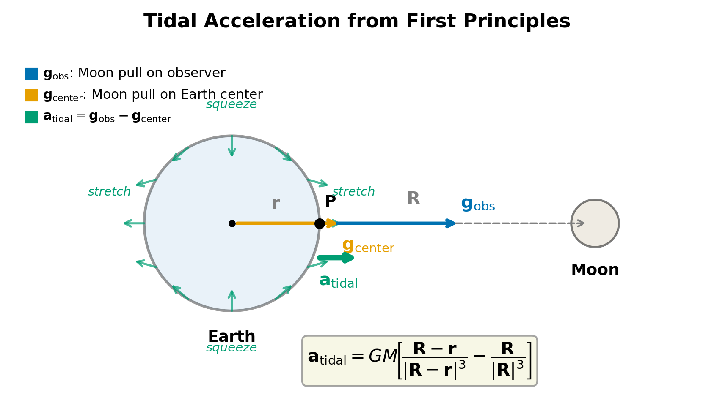
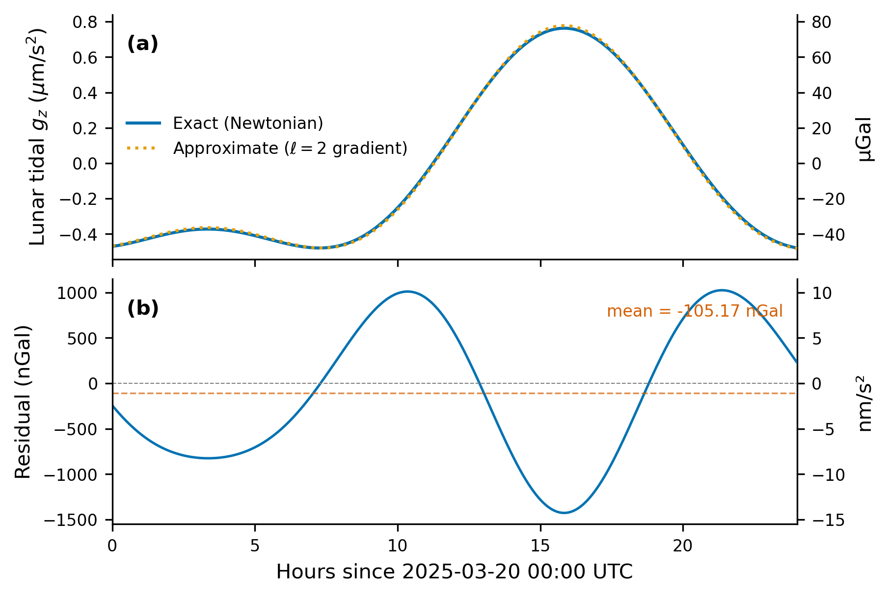

## 6. The Tidal Acceleration (The Heart of the Model)

Everything built so far — geodetic coordinates, measurement axis, normal
gravity, ephemerides — serves one purpose: computing the **tidal acceleration**
that a celestial body produces at a point on Earth's surface.  This is the
signal that makes $g$ vary with time.

We derive the tidal acceleration from first principles, estimate its magnitude,
examine (and reject) the gradient approximation, and project it onto a sensor
axis.


### 6.1 Tidal forces from first principles

#### The setup

Place the origin at Earth's center of mass.  An observer at position
$\mathbf{r}$ on the surface sees a distant body of mass $M$ at position
$\mathbf{R}$.  The tidal acceleration is the differential gravitational
acceleration between the observer and Earth's center.  Figure 9 illustrates
the geometry and the resulting quadrupolar tidal field pattern.



#### Gravity at two points

The gravitational acceleration due to $M$ at an arbitrary point $\mathbf{p}$ is

$$
\mathbf{g}(\mathbf{p}) = \frac{GM(\mathbf{R} - \mathbf{p})}{|\mathbf{R} - \mathbf{p}|^3}.
$$

Evaluating at the observer ($\mathbf{r}$) and at Earth's center ($\mathbf{0}$):

$$
\mathbf{g}_{\mathrm{obs}} = \frac{GM(\mathbf{R} - \mathbf{r})}{|\mathbf{R} - \mathbf{r}|^3},
\qquad
\mathbf{g}_{\mathrm{center}} = \frac{GM\,\mathbf{R}}{R^3},
$$

where $R \equiv |\mathbf{R}|$.

#### The tidal acceleration

Earth's center is in free fall toward the Moon, accelerating at
$\mathbf{g}_{\mathrm{center}}$.  In the co-falling frame, the residual
acceleration on the observer is the difference:

$$
\boxed{
\mathbf{a}_{\mathrm{tidal}}
  = \mathbf{g}_{\mathrm{obs}} - \mathbf{g}_{\mathrm{center}}
  = GM \left[
      \frac{\mathbf{R} - \mathbf{r}}{|\mathbf{R} - \mathbf{r}|^3}
    - \frac{\mathbf{R}}{R^3}
  \right].
}
$$

This is the **exact Newtonian tidal acceleration**, and it is what Pytheas
computes.

#### Physical picture

In Earth's freely-falling frame the Moon's field vanishes at the center by
construction.  But the observer is displaced by $\mathbf{r} \sim 6{,}400$ km,
where the field gradient is nonzero.  The resulting tidal field stretches Earth
along the Earth--Moon line (near side pulled harder, far side less) and
compresses it transversely — producing the two tidal bulges and two tidal
minima.

#### Implementation

```python
def tidal_acceleration(r, R, GM):
    d = R - r
    return GM * (d / np.linalg.norm(d)**3 - R / np.linalg.norm(R)**3)
```

No approximations — this evaluates the full Newtonian expression directly.


### 6.2 How big is this?

#### The Moon

| Quantity | Value |
|----------|-------|
| $GM_{\mathrm{Moon}}$ | $4.9028695 \times 10^{12}\ \mathrm{m^3/s^2}$ |
| $R$ (Earth–Moon distance) | $\approx 384{,}400\ \mathrm{km} = 3.844 \times 10^8\ \mathrm{m}$ |
| $r$ (Earth's radius) | $\approx 6{,}371\ \mathrm{km} = 6.371 \times 10^6\ \mathrm{m}$ |

Since $r \ll R$, the leading-order estimate (Section 6.3) gives:

$$
a_{\mathrm{tidal}} \approx \frac{2\,GM\,r}{R^3}.
$$

Substituting:

$$
a_{\mathrm{tidal}}^{\mathrm{Moon}}
  \approx \frac{2 \times 4.903 \times 10^{12} \times 6.371 \times 10^6}
               {(3.844 \times 10^8)^3}
  = \frac{6.247 \times 10^{19}}{5.680 \times 10^{25}}
  \approx 1.10 \times 10^{-6}\ \mathrm{m/s^2}.
$$

About $1.1\ \mu\mathrm{m/s^2}$, or **one part in $10^7$ of $g$**.  Modern
gravimeters resolve a few nGal ($1\ \mathrm{nGal} = 10^{-11}\ \mathrm{m/s^2}$),
so the lunar tide is an enormous signal at $\sim 110{,}000\ \mathrm{nGal}$.

#### The Sun

| Quantity | Value |
|----------|-------|
| $GM_{\mathrm{Sun}}$ | $1.327 \times 10^{20}\ \mathrm{m^3/s^2}$ |
| $R$ (Earth–Sun distance) | $\approx 1\ \mathrm{AU} = 1.496 \times 10^{11}\ \mathrm{m}$ |

$$
a_{\mathrm{tidal}}^{\mathrm{Sun}}
  \approx \frac{2 \times 1.327 \times 10^{20} \times 6.371 \times 10^6}
               {(1.496 \times 10^{11})^3}
  = \frac{1.691 \times 10^{27}}{3.349 \times 10^{33}}
  \approx 5.05 \times 10^{-7}\ \mathrm{m/s^2}.
$$

About $0.5\ \mu\mathrm{m/s^2}$ — roughly half the lunar contribution.

#### Why the Moon wins: the $R^{-3}$ law

Despite $GM_{\mathrm{Sun}} \approx 2.7 \times 10^7 \times GM_{\mathrm{Moon}}$,
tidal acceleration scales as $GM/R^3$, not $GM/R^2$.  The Sun is $\sim 389$
times farther away:

$$
\frac{a_{\mathrm{tidal}}^{\mathrm{Sun}}}{a_{\mathrm{tidal}}^{\mathrm{Moon}}}
  = \frac{GM_{\mathrm{Sun}}}{GM_{\mathrm{Moon}}} \times
    \left(\frac{R_{\mathrm{Moon}}}{R_{\mathrm{Sun}}}\right)^3
  \approx 2.7 \times 10^7 \times \left(\frac{1}{389}\right)^3
  \approx 2.7 \times 10^7 \times 1.70 \times 10^{-8}
  \approx 0.46.
$$

The extra power of distance is decisive: the Moon dominates by a factor of
$\sim 2.2$.


### 6.3 The gradient approximation (and why Pytheas doesn't use it)

Many textbooks and tidal codes Taylor-expand the tidal acceleration for small
$r/R$ and keep only the leading term — the "gradient" or "quadrupole"
approximation.

#### Deriving the first-order expansion

Expand

$$
\frac{\mathbf{R} - \mathbf{r}}{|\mathbf{R} - \mathbf{r}|^3}
$$

in powers of $\mathbf{r}/R$.  Define $\hat{\mathbf{R}} = \mathbf{R}/R$ and
$\mathbf{d} = \mathbf{R} - \mathbf{r}$, so

$$
|\mathbf{d}|^2
  = R^2 \left(1 - 2\,\frac{\mathbf{R} \cdot \mathbf{r}}{R^2}
         + \frac{r^2}{R^2}\right).
$$

Setting $\epsilon = \frac{2\,\mathbf{R} \cdot \mathbf{r}}{R^2} - \frac{r^2}{R^2}$ gives $|\mathbf{d}|^2 = R^2(1 - \epsilon)$ with $\epsilon = O(r/R)$.  Then

$$
\frac{1}{|\mathbf{d}|^3} = \frac{1}{R^3}(1 - \epsilon)^{-3/2}
  = \frac{1}{R^3}\left(1 + \tfrac{3}{2}\epsilon + O(\epsilon^2)\right).
$$

Retaining only the $O(r/R)$ piece of $\epsilon$:

$$
\frac{1}{|\mathbf{d}|^3}
  \approx \frac{1}{R^3}\left(1 + \frac{3\,\mathbf{R} \cdot \mathbf{r}}{R^2}\right)
  + O\!\left(\frac{r^2}{R^2}\right).
$$

Multiplying by $\mathbf{d} = \mathbf{R} - \mathbf{r}$ and keeping first-order terms:

$$
\frac{\mathbf{R} - \mathbf{r}}{|\mathbf{d}|^3}
  \approx \frac{\mathbf{R}}{R^3}
    + \frac{1}{R^3}\left[
        \frac{3(\mathbf{R} \cdot \mathbf{r})}{R^2}\,\mathbf{R} - \mathbf{r}
      \right]
    + O\!\left(\frac{r^2}{R^2}\right).
$$

Subtracting $\mathbf{R}/R^3$:

$$
\mathbf{a}_{\mathrm{tidal}}
  = GM\left[\frac{\mathbf{R} - \mathbf{r}}{|\mathbf{d}|^3} - \frac{\mathbf{R}}{R^3}\right]
  \approx \frac{GM}{R^3}\left[
      3\,(\hat{\mathbf{R}} \cdot \mathbf{r})\,\hat{\mathbf{R}} - \mathbf{r}
    \right]
  + O\!\left(\frac{r^2}{R^2}\right).
$$

Equivalently:

$$
\boxed{
\mathbf{a}_{\mathrm{tidal}}
  \approx -\frac{GM}{R^3}\left[
      \mathbf{r} - 3\,(\mathbf{r} \cdot \hat{\mathbf{R}})\,\hat{\mathbf{R}}
    \right].
}
$$

#### Geometric interpretation

Decompose $\mathbf{r}$ into components parallel and perpendicular to
$\hat{\mathbf{R}}$:

- **Along $\hat{\mathbf{R}}$**: tidal acceleration $= +2\,GM\,r_\parallel/R^3$.
  The field **stretches** along the Earth--body line.

- **Perpendicular to $\hat{\mathbf{R}}$**: tidal acceleration $= -GM\,r_\perp/R^3$.
  The field **compresses** transversely.

Stretching is twice as strong as compression, with opposite signs — the
familiar quadrupolar pattern.  The tidal tensor is trace-free:
$(+2 - 1 - 1)\times GM/R^3 = 0$, consistent with Laplace's equation in vacuum.

#### Accuracy assessment

The dropped terms are $O(r^2/R^2)$ relative to leading order.

**For the Moon:**

$$
\left(\frac{r}{R}\right)^2
  = \left(\frac{6.371 \times 10^6}{3.844 \times 10^8}\right)^2
  = (1.657 \times 10^{-2})^2
  \approx 2.7 \times 10^{-4}.
$$

With a leading tidal acceleration of $\sim 110{,}000$ nGal, the truncation
error is:

$$
2.7 \times 10^{-4} \times 110{,}000\ \mathrm{nGal} \approx 30\ \mathrm{nGal}.
$$

This falls squarely in Pytheas's 10--100 nGal target accuracy range — an
unacceptable error from an avoidable approximation.  Figure 10 compares the
exact and approximate tidal accelerations over 24 hours at Munich; the residual
panel reveals the systematic $\sim 30$ nGal error.



**For the Sun:**

$$
\left(\frac{r}{R}\right)^2
  = \left(\frac{6.371 \times 10^6}{1.496 \times 10^{11}}\right)^2
  \approx 1.8 \times 10^{-9}.
$$

Completely negligible — the gradient approximation is essentially exact for the
Sun.

#### Why Pytheas uses the exact formula

The gradient approximation saves one norm evaluation — negligible cost on
modern hardware.  The exact formula

$$
\mathbf{a}_{\mathrm{tidal}} = GM\left[
  \frac{\mathbf{R} - \mathbf{r}}{|\mathbf{R} - \mathbf{r}|^3}
  - \frac{\mathbf{R}}{R^3}
\right]
$$

eliminates the $\sim 30$ nGal lunar truncation error for free.  The general
principle: **use the exact formula when it costs the same as the approximate
one**.  Approximations are valuable for insight (as the gradient form is for
physical intuition) but not for numerical evaluation when the exact expression
is equally cheap.


### 6.4 Projecting onto your sensor

The tidal acceleration $\mathbf{a}_{\mathrm{tidal}}$ is a 3D vector in ECEF
coordinates, with radial, northward, and eastward components.  A gravimeter
measures only the component along its sensitive axis $\hat{\mathbf{n}}$
(defined in Section 2):

$$
\boxed{
a_{\mathrm{proj}} = \mathbf{a}_{\mathrm{tidal}} \cdot \hat{\mathbf{n}}.
}
$$

#### What different orientations see

**Vertical sensor** ($\hat{\mathbf{n}} = \hat{\mathbf{e}}_{\mathrm{up}}$):
measures the radial tidal component, dominated by $+2\,GM\,r_\parallel/R^3$
when the body is near zenith or nadir.  Peak: $\sim 1\ \mu\mathrm{m/s^2}$
(Moon).

**Horizontal sensor** ($\hat{\mathbf{n}}$ in the east--north plane): measures
the tangential component, at most $GM\,r/R^3$ — half the vertical peak.  About
$0.5\ \mu\mathrm{m/s^2}$ for the Moon, with strong dependence on the Moon's
azimuth relative to the sensor orientation.

**Tilted sensor**: linear combination set by the zenith and azimuth angles.

#### Implementation

Pytheas computes this projection for each body and sums:

```python
n_hat = measurement_axis(lat, lon, zenith, azimuth)
a_moon = tidal_acceleration(r, R_moon, GM_MOON)
a_sun  = tidal_acceleration(r, R_sun,  GM_SUN)

g_tidal_moon = np.dot(a_moon, n_hat)
g_tidal_sun  = np.dot(a_sun,  n_hat)
g_tidal      = g_tidal_moon + g_tidal_sun
```

The resulting `g_tidal` is the time-varying part of $g$ riding on top of the
static normal gravity.  Combined with the elastic-Earth amplification factor
(Section 7), this is what Pytheas reports.
