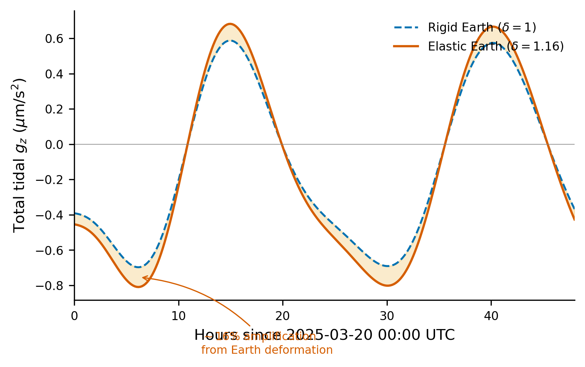

# Section 7: The Earth Fights Back (Elastic Response)

The preceding sections computed tidal acceleration treating the Earth as rigid. In reality, the Earth is an elastic solid that deforms under tidal stress. This deformation modifies the gravimeter reading, amplifying the tidal signal by about 16%. This section derives the correction factor.


## 7.1 The Earth is not rigid

### The body tide

The tidal force field acts on every element of the Earth, not just a test mass at the surface. Its quadrupolar pattern stretches the Earth along the Earth--Moon line and compresses it transversely, producing a solid-body bulge -- the **body tide**. The crust rises and falls by ~30 cm (lunar) and ~15 cm (solar) twice per day.

### Why you don't notice

The body tide has a wavelength comparable to the Earth's circumference; over human-scale distances the displacement is uniform and imperceptible. A gravimeter, however, measures gravitational acceleration at a fixed coordinate point (latitude, longitude, ellipsoidal height). When the solid Earth deforms, two things change at that point, both affecting the reading.


## 7.2 How deformation changes what you measure

A gravimeter bolted to the crust rides with the deforming Earth. Two competing effects alter the measured gravity:

**Effect 1: Free-air effect.**
The tidal bulge lifts the gravimeter radially outward by $\Delta r$, reducing $g$ (same mechanism as free-air gravity decrease with altitude).

**Effect 2: Mass redistribution.**
Deformation shifts mass, changing the gravitational potential -- and hence the acceleration -- at the measurement point.

These effects partially oppose each other. Quantifying them requires the **Love numbers**.


## 7.3 Love numbers: parameterizing deformation

The Love numbers (A. Love, 1911) are dimensionless parameters relating the Earth's deformational response to the applied tidal potential.

### The tidal potential

The tidal potential is dominated by its degree-2 (quadrupolar) spherical harmonic component $V_2$. The relevant properties are:

- $V_2$ is a degree-2 spherical harmonic in the angular coordinates
- At the Earth's surface ($r = R$), $V_2$ depends on the zenith angle of the tide-raising body and its distance
- The tidal acceleration on a rigid Earth equals $-\partial V_2 / \partial r$ in the radial direction

Everything below is expressed as ratios relative to $V_2$; its explicit form is not needed.

### The displacement Love number $h_2$

$h_2$ quantifies the radial surface displacement in response to $V_2$:

$$\Delta r = h_2 \, \frac{V_2}{g}$$

A perfectly fluid body in hydrostatic equilibrium with the tidal potential would have $\Delta r = V_2/g$, so $h_2$ measures the fraction of the fluid limit achieved:
- $h_2 = 1$: perfectly fluid body
- $h_2 = 0$: perfectly rigid body
- Real Earth: $h_2 \approx 0.61$ (61% of fluid limit)

### The potential Love number $k_2$

The deformation-induced additional gravitational potential at the surface is:

$$V_{\text{deformation}} = k_2 \, V_2$$

- $k_2 = 0$: rigid body
- Real Earth: $k_2 \approx 0.30$

### Why only degree 2?

Higher-degree terms involve $(R/d)^l$ with $R/d \sim 1/60$ (Moon) and $R/d \sim 4 \times 10^{-5}$ (Sun), so they are strongly suppressed. The degree-3 lunar contribution is ~1.7% of degree 2 -- negligible at our accuracy level.


## 7.4 Deriving the gravimetric factor $\delta$

We combine three contributions: (1) rigid-Earth tidal gravity, (2) free-air correction from displacement, and (3) mass-redistribution potential effect.

### Step 1: Tidal gravity on a rigid Earth

The radial gravity perturbation is $\Delta g_{\text{rigid}} = -\partial V_2/\partial r$. Since $V_2$ is a degree-2 external harmonic, it scales as $r^2$ inside, giving $\partial V_2/\partial r = 2V_2/r$. At $r = R$:

$$\boxed{\Delta g_{\text{rigid}} = -\frac{2 \, V_2}{R}}$$

### Step 2: Gravity change from radial displacement (free-air effect)

The gravimeter is displaced outward by $\Delta r = h_2 V_2/g$. The free-air gradient for a spherical Earth is $\partial g/\partial r = -2g/R$ (from $g = GM/r^2$). The gravity change due to displacement is:

$$\Delta g_{\text{disp}} = \frac{\partial g}{\partial r} \, \Delta r = -\frac{2g}{R} \cdot \frac{h_2 V_2}{g}$$

$$\boxed{\Delta g_{\text{disp}} = -\frac{2 \, h_2 \, V_2}{R}}$$

The sign matches $\Delta g_{\text{rigid}}$: the gravimeter rides the bulge upward, moving away from Earth's center, so the measured $g$ drops further. The displacement *amplifies* $|\Delta g|$.

### Step 3: Gravity change from mass redistribution (potential effect)

The deformation adds a potential $k_2 V_2$ at the surface. This was already accounted for in Step 1 as part of $V_2$, so only the deformation-generated part $k_2 V_2$ remains. This is an internal degree-2 potential, decaying as $r^{-(l+1)} = r^{-3}$ outside the surface:

$$\frac{\partial (k_2 V_2)}{\partial r}\bigg|_{\text{ext}} = -3 \, \frac{k_2 V_2}{R}$$

The gravity perturbation $\Delta g_{\text{pot}} = -\partial(k_2 V_2)/\partial r$:

$$\boxed{\Delta g_{\text{pot}} = +\frac{3 \, k_2 \, V_2}{R}}$$

This is *positive* -- opposite to $\Delta g_{\text{rigid}}$. The bulge of extra mass beneath the gravimeter partially counteracts the tidal stretching, *reducing* $|\Delta g|$.

### Step 4: Combine all three contributions

$$\Delta g_{\text{elastic}} = \Delta g_{\text{rigid}} + \Delta g_{\text{disp}} + \Delta g_{\text{pot}}$$

$$= -\frac{2V_2}{R} - \frac{2 h_2 V_2}{R} + \frac{3 k_2 V_2}{R} = -\frac{2V_2}{R}\left(1 + h_2 - \frac{3}{2} k_2\right)$$

$$\Delta g_{\text{elastic}} = \Delta g_{\text{rigid}} \cdot \underbrace{\left(1 + h_2 - \frac{3}{2}\, k_2\right)}_{\delta}$$

The gravimetric factor is:

$$\boxed{\delta = 1 + h_2 - \frac{3}{2}\, k_2}$$

### Summary of the three terms

| Term | Origin | Expression | Effect on $\lvert\Delta g\rvert$ |
|------|--------|------------|----------------------|
| 1 | Rigid-Earth tidal gravity | $-2V_2/R$ | Baseline |
| $+h_2$ | Displacement (free-air) | $-2h_2 V_2/R$ | Amplifies |
| $-\frac{3}{2}k_2$ | Mass redistribution | $+3k_2 V_2/R$ | Reduces |

The displacement dominates because the gravimeter rides the tidal bulge upward. The mass redistribution partially cancels this, as the deformed Earth concentrates mass beneath the bulge.


## 7.5 Numerical values

### IERS 2010 Love numbers

The IERS 2010 Conventions give nominal degree-2 Love numbers for an SNREI Earth model:

$$h_2 = 0.6078, \qquad k_2 = 0.2980$$

### The gravimetric factor

$$\delta = 1 + 0.6078 - 1.5 \times 0.2980$$

$$\delta = 1 + 0.6078 - 0.4470$$

$$\boxed{\delta = 1.1608}$$

### Physical interpretation

The tidal signal is **16% larger** than on a rigid Earth:

- The rigid-Earth baseline: **1.0000** (100%)
- The displacement (free-air) amplification: **+0.6078** (+60.8%)
- The mass redistribution reduction: **-0.4470** (-44.7%)
- **Net amplification: +0.1608 (+16.1%)**

The displacement effect dominates, but the mass redistribution substantially counteracts it, so the net amplification is much less than $h_2$ alone would suggest. Figure 11 overlays rigid and elastic predictions, with the shaded region highlighting the 16% amplification.



### How Pytheas applies this

The gravimetric factor is applied as a multiplicative correction to the tidal acceleration:

```python
H2 = 0.6078
K2 = 0.2980
DELTA_GRAV = 1.0 + H2 - 1.5 * K2   # = 1.1608

a_moon = DELTA_GRAV * tidal_acceleration(r, moon_position_ecef(dt), GM_MOON)
a_sun  = DELTA_GRAV * tidal_acceleration(r, sun_position_ecef(dt),  GM_SUN)
```

The `tidal_acceleration` function computes the rigid-Earth value; multiplying by $\delta$ gives the measured tidal gravity change on the elastic Earth.


## 7.6 What we are ignoring

The derivation assumes a single, frequency-independent gravimetric factor $\delta$. Several effects are omitted.

### Frequency dependence of Love numbers

The Love numbers depend on forcing frequency. The values 0.6078 and 0.2980 are appropriate for semi-diurnal tides (~12 h period). At longer periods the mantle flows viscously, increasing $h_2$; at diurnal periods a resonance significantly alters the Love numbers.

### The Free Core Nutation resonance

Near the K1 tidal frequency (~23.93 h period), tidal forcing resonates with the **Free Core Nutation (FCN)** -- a normal mode in which the fluid outer core and solid mantle precess around slightly different axes. Near this resonance the Love numbers change rapidly, and $\delta$ can deviate from 1.1608 by up to ~1% (~10 nGal). This is the **single largest error source** in Pytheas. A proper correction requires frequency-dependent Love numbers for each tidal constituent.

### Higher-degree Love numbers

The degree-3 lunar tidal component (~1.7% of degree 2) involves Love numbers $h_3$, $k_3$. The effect on gravity is negligible at the 10 nGal level.

### Latitude dependence

The Love numbers assume a spherically symmetric Earth. Lateral variations in elastic properties cause effective Love numbers to vary slightly with location (typically $<$1%), subsumed into ocean loading corrections for coastal sites.

### What these omissions cost

| Omission | Typical error | Notes |
|----------|--------------|-------|
| Frequency-independent $\delta$ (no FCN) | $\sim$10 nGal | Largest near K1 frequency |
| No degree-3 Love numbers | $<$1 nGal | Suppressed by $(R/d)$ |
| No lateral variation | $<$1 nGal | Subsumed into ocean loading |

For Pytheas's target accuracy of ~10 nGal at inland sites, using a single gravimetric factor $\delta = 1.1608$ is adequate. The FCN resonance is the dominant limitation of this approach.
