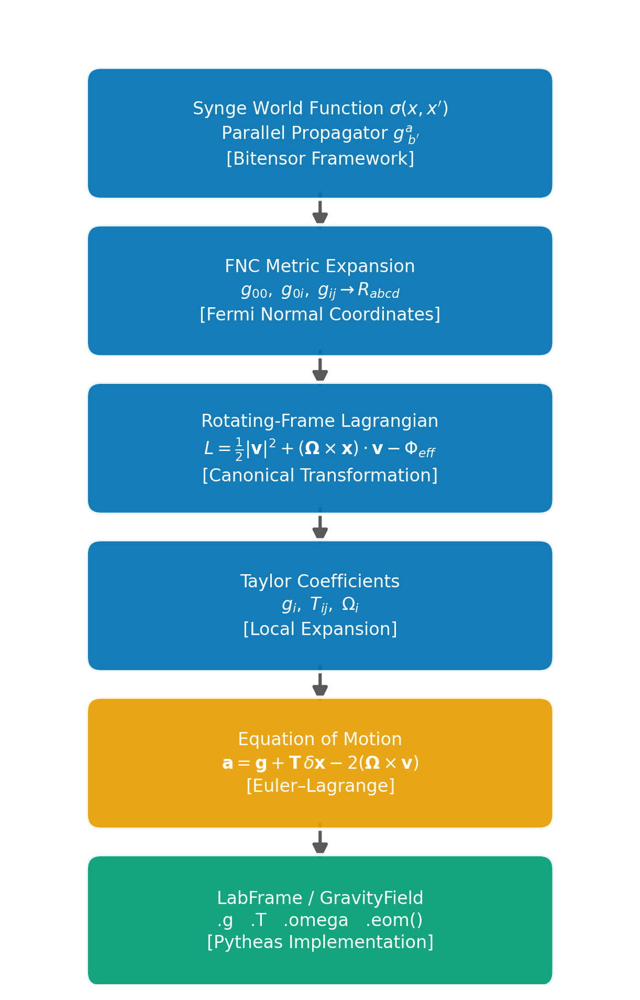

# 9. The Covariant Taylor Expansion and the Lab Frame

The previous section established the Fermi normal coordinate (FNC) framework
and showed how each physical effect --- proper acceleration, Coriolis force,
centrifugal force, tidal curvature --- appears as a distinct term in the
geodesic equation.  That analysis answers the question "what does a freely
falling test mass do in the lab frame?", but a gravimetry library needs
something more concrete: a **local gravity field** that can be evaluated,
differentiated, and propagated to nearby points.

This section bridges the gap.  Starting from the bitensor machinery that
underlies the FNC expansion, we derive a Taylor expansion of the effective
gravitational potential about the lab origin, identify three measurable
coefficients --- the gravity vector $\mathbf{g}$, the gravity gradient tensor
$\mathbf{T}$, and the rotation vector $\boldsymbol{\Omega}$ --- and arrive at
the equation of motion

$$
\ddot{\mathbf{x}} = \mathbf{g} + \mathbf{T}\cdot\delta\mathbf{x} - 2\,\boldsymbol{\Omega}\times\mathbf{v}
\tag{9.1}
$$

that the `LabFrame` class implements.  Along the way we prove two important
trace identities (Poisson and Laplace) and show that the centrifugal
acceleration is entirely absorbed into $\mathbf{g}$ and $\mathbf{T}$, so that
only the velocity-dependent Coriolis term appears explicitly.

We continue to use signature $(-,+,+,+)$, ENU coordinates, and the convention
$g_U < 0$ at the Earth's surface.


---

## 9.1 The Bitensor Framework

The covariant Taylor expansion generalises the ordinary Taylor series to curved
spacetime.  Three objects provide the necessary machinery.

### The world function

The *Synge world function* $\sigma(x, x')$ assigns to every pair of points
connected by a unique geodesic the quantity

$$
\sigma(x, x') = \tfrac{1}{2}\,\varepsilon\,(\text{geodesic length})^2,
\tag{9.2}
$$

where $\varepsilon = -1$ for timelike and $+1$ for spacelike geodesics.  If
the geodesic is affinely parameterised with $\gamma(0) = x'$ and
$\gamma(1) = x$, one equivalently has
$\sigma = \tfrac{1}{2}\,g_{ab}\,\dot\gamma^a\dot\gamma^b\,(\Delta\lambda)^2$.

The covariant gradient $\sigma_a \equiv \nabla_a\sigma$ is the tangent vector
to the geodesic at $x$, pointing away from $x'$.  The object $-\sigma^a$
therefore points from $x$ toward $x'$ and serves as the curved-space
displacement vector.  At coincidence ($x' \to x$) the world function vanishes,
$[\sigma] = 0$, and the mixed second derivative satisfies

$$
[\sigma_{a\,b'}] = -g_{ab}.
\tag{9.3}
$$

### The parallel propagator

The *parallel propagator* $g^a_{\ b'}(x, x')$ transports a vector from $x'$
to $x$ along the geodesic:

$$
V^a(x) = g^a_{\ b'}(x,x')\,V^{b'}(x').
\tag{9.4}
$$

It satisfies the parallel-transport equation $\sigma^c\nabla_c\,g^a_{\ b'} = 0$
with boundary condition $[g^a_{\ b'}] = \delta^a_{\ b}$.  In terms of the
world function,

$$
g^a_{\ b'} = -g^{ac}\,\sigma_{cb'}.
\tag{9.5}
$$

For a rank-2 tensor one applies one propagator per index:
$T^{ij}_{\text{local}} = g^i_{\ a'}\,g^j_{\ b'}\,T^{a'b'}$.

### The covariant Taylor expansion theorem

Let $f(x')$ be a scalar field.  Its value at a nearby point $x'$ is
reconstructed from data at $x$ by

$$
f(x') = f - (\nabla_a f)\,\sigma^a + \tfrac{1}{2}(\nabla_a\nabla_b f)\,\sigma^a\sigma^b - \cdots
\tag{9.6}
$$

where everything on the right is evaluated at $x$.  The alternating signs
arise because $-\sigma^a$ is the displacement from $x$ to $x'$.  For a
vector field $V_a$, the parallel propagator handles index transport:

$$
V_{a'}(x') = g^b_{\ a'}\!\left[V_b - V_{b;c}\,\sigma^c + \tfrac{1}{2}\,V_{b;cd}\,\sigma^c\sigma^d - \cdots\right].
\tag{9.7}
$$

The key insight is that covariant derivatives replace partial derivatives,
$-\sigma^a$ replaces $\Delta x^a$, and the parallel propagator handles the
transport of tensor indices between tangent spaces.  At second order the
Riemann curvature enters through the commutation of covariant derivatives.

### Application to the metric: recovering the FNC expansion

Applying Eq. (9.6) and its tensor generalisation to the metric $g_{ab}$
about the lab worldline, using the orthonormal Fermi-Walker-transported
tetrad as the coordinate basis, one recovers the FNC metric of Section 8.1:

$$
g_{00} = -\!\left(1 + \frac{a_i X^i}{c^2}\right)^{\!2} + R_{0i0j}\,X^i X^j + \mathcal{O}(X^3),
\tag{9.8a}
$$

$$
g_{0i} = \tfrac{2}{3}\,R_{0jik}\,X^j X^k + \epsilon_{ijk}\,\Omega^j X^k + \mathcal{O}(X^3),
\tag{9.8b}
$$

$$
g_{ij} = \delta_{ij} - \tfrac{1}{3}\,R_{ikjl}\,X^k X^l + \mathcal{O}(X^3).
\tag{9.8c}
$$

The numerical coefficients ($1$, $2/3$, $1/3$) are uniquely fixed by the
Riemann symmetries and the requirement that the Christoffel symbols vanish at
the origin.  This is the standard result of Manasse & Misner (1963), reproduced
in Ni & Zimmerman (1978) and Poisson & Will (2014, Ch. 9).

The bitensor framework is thus the *theoretical engine* behind the FNC
expansion.  For the rest of this section we work directly with the expanded
metric and its physical consequences.


---

## 9.2 The Rotating Lab Frame

### From the FNC metric to the ADM Hamiltonian

Section 8.1 gave the FNC metric for a non-geodesic, rotating observer.  We
now extract physics from it using the ADM (Arnowitt-Deser-Misner) decomposition
into lapse $N$, shift $N_i$, and spatial metric $\gamma_{ij}$:

$$
N^2 = 1 + \frac{2a_j x^j}{c^2} + R_{0i0j}\,x^i x^j + \mathcal{O}(|x|^3),
\tag{9.9}
$$

$$
N_i = -\tfrac{2}{3}\,R_{0jik}\,x^j x^k + \mathcal{O}(|x|^3),
\qquad
\gamma_{ij} = \delta_{ij} + \mathcal{O}(|x|^2).
\tag{9.10}
$$

For a non-relativistic test particle ($|v| \ll c$, laboratory heights
$h \ll c^2/g$) the ADM Hamiltonian reduces to

$$
H_{\text{FNC}} = \frac{p^2}{2m} + m\,\Phi_{\text{grav}}(\mathbf{x}),
\tag{9.11}
$$

where the **gravitational potential in FNC** combines the proper acceleration
at the origin with the curvature-dependent gradient:

$$
\boxed{
\Phi_{\text{grav}}(\mathbf{x}) = a_j\,x^j + \frac{c^2}{2}\,R_{0i0j}\,x^i x^j
}
\tag{9.12}
$$

The first term encodes the zeroth-order gravity ($g_i = -a_i$ at the origin);
the second encodes the tidal field from spacetime curvature.  Post-Newtonian
corrections (gravitational redshift of kinetic energy, gravitomagnetic
coupling) are suppressed by factors of $\Phi/c^2 \sim 10^{-16}$ for
laboratory-scale displacements and are dropped.

### Canonical transformation to the rotating frame

The lab co-rotates with the Earth.  In the Hamiltonian formulation, passing
to the rotating frame is a canonical transformation generated by the angular
momentum $\mathbf{L} = \mathbf{x}\times\mathbf{p}$:

$$
\boxed{
H_{\text{rot}} = H_{\text{FNC}} - \boldsymbol{\Omega}\cdot\mathbf{L}
}
\tag{9.13}
$$

This is the fundamental relation: **rotation subtracts the rotational kinetic
energy** from the Hamiltonian.  The generating function's time derivative
contributes $\partial F_2/\partial t = -\boldsymbol{\Omega}\cdot(\mathbf{x}\times\mathbf{p})$, which follows from the cyclic property of the
scalar triple product.

Explicitly:

$$
H_{\text{rot}} = \frac{p^2}{2m} + m\,\Phi_{\text{grav}}(\mathbf{x}) - \boldsymbol{\Omega}\cdot(\mathbf{x}\times\mathbf{p}).
\tag{9.14}
$$

Note that no centrifugal potential appears explicitly --- the centrifugal
effect is encoded in the non-trivial relationship between canonical momentum
$\mathbf{p}$ and velocity $\mathbf{v}$ in the rotating frame.

### The Lagrangian

Hamilton's equation $\dot{x}^i = \partial H/\partial p_i$ yields
$\mathbf{v} = \mathbf{p}/m - \boldsymbol{\Omega}\times\mathbf{x}$, hence
$\mathbf{p} = m(\mathbf{v} + \boldsymbol{\Omega}\times\mathbf{x})$.
Performing the Legendre transform $L = \mathbf{p}\cdot\mathbf{v} - H$ and
defining the effective potential

$$
\Phi_{\text{eff}} = \Phi_{\text{grav}} - \tfrac{1}{2}|\boldsymbol{\Omega}\times\mathbf{x}|^2,
\tag{9.15}
$$

we arrive at the rotating-frame Lagrangian (per unit mass):

$$
\boxed{
L = \tfrac{1}{2}|\mathbf{v}|^2 + (\boldsymbol{\Omega}\times\mathbf{x})\cdot\mathbf{v} - \Phi_{\text{eff}}(\mathbf{x})
}
\tag{9.16}
$$

The three terms have clear physical roles:
- $\tfrac{1}{2}|\mathbf{v}|^2$: kinetic energy in the rotating frame,
- $(\boldsymbol{\Omega}\times\mathbf{x})\cdot\mathbf{v}$: Coriolis coupling (analogous to a magnetic vector potential),
- $\Phi_{\text{eff}}$: effective potential including both gravity and centrifugal.

The Legendre transform makes explicit how the centrifugal potential emerges
from the Hamiltonian structure: it is a consequence of
$\mathbf{p} \neq m\mathbf{v}$ in the rotating frame.

### Taylor expansion and identification of coefficients

We expand $\Phi_{\text{eff}}$ about the lab origin in the displacement
$\delta\mathbf{x} = \mathbf{x} - \mathbf{x}_0$:

$$
\Phi_{\text{eff}}(\mathbf{x}) = \Phi_{\text{eff}}(\mathbf{x}_0) + \frac{\partial\Phi_{\text{eff}}}{\partial x^i}\bigg|_0\!\delta x^i + \frac{1}{2}\,\frac{\partial^2\Phi_{\text{eff}}}{\partial x^i\partial x^j}\bigg|_0\!\delta x^i\delta x^j + \cdots
\tag{9.17}
$$

This defines two measurable coefficients.

**The gravity vector** (including centrifugal):

$$
\boxed{
g_i \equiv -\frac{\partial\Phi_{\text{eff}}}{\partial x^i}\bigg|_{\mathbf{x}_0}
}
\tag{9.18}
$$

At the FNC origin, $\partial\Phi_{\text{grav}}/\partial x^i|_0 = a_i$ (from
the linear term in Eq. 9.12) and the centrifugal gradient vanishes, giving

$$
g_i\big|_{\mathbf{x}_0} = -a_i.
\tag{9.19}
$$

The gravity vector at the lab origin equals the negative of the proper
acceleration --- the defining property of Fermi normal coordinates.  In ENU
coordinates at the surface, $g_i = (0, 0, -g)$ to leading order, where
$g \approx 9.81$ m/s$^2$ already includes the centrifugal correction through
the Somigliana formula (Section 3.4).

**The gravity gradient tensor**:

$$
\boxed{
T_{ij} \equiv -\frac{\partial^2\Phi_{\text{eff}}}{\partial x^i\,\partial x^j}\bigg|_{\mathbf{x}_0}
}
\tag{9.20}
$$

Evaluating at the origin:

$$
T_{ij}\big|_0 = -c^2\,R_{0i0j} + \Omega^2\delta_{ij} - \Omega_i\Omega_j.
\tag{9.21}
$$

This symmetric $3\times 3$ tensor encodes the tidal stretching and compression
of the gravitational field, with contributions from spacetime curvature
($-c^2 R_{0i0j}$) and the centrifugal effect ($\Omega^2\delta_{ij} - \Omega_i\Omega_j$).

The **rotation vector** $\Omega_i$ enters through the Coriolis coupling
$(\boldsymbol{\Omega}\times\mathbf{x})\cdot\mathbf{v}$ and does not appear in
the potential expansion.  In ENU coordinates,
$\boldsymbol{\Omega} = (0,\;\Omega\cos\varphi,\;\Omega\sin\varphi)$
with $\Omega = 7.292\,115\times10^{-5}$ rad/s.

The expanded Lagrangian (per unit mass, dropping the constant $\Phi_{\text{eff}}(\mathbf{x}_0)$) is therefore

$$
L = \tfrac{1}{2}|\mathbf{v}|^2 + (\boldsymbol{\Omega}\times\delta\mathbf{x})\cdot\mathbf{v} + g_i\,\delta x^i + \tfrac{1}{2}\,T_{ij}\,\delta x^i\,\delta x^j + \cdots
\tag{9.22}
$$

This is formally identical to the Lagrangian of a charged particle in a
uniform magnetic field $\mathbf{B} = 2\boldsymbol{\Omega}$, with the Coriolis
coupling playing the role of the magnetic vector potential (symmetric gauge).


---

## 9.3 Equation of Motion and Identities

### Deriving the equation of motion

Starting from Hamilton's equations for $H_{\text{rot}}$ (Eq. 9.14), the
momentum equation reads

$$
\dot{p}_i = -(\boldsymbol{\Omega}\times\mathbf{p})_i - m\,\frac{\partial\Phi_{\text{grav}}}{\partial x^i}.
\tag{9.23}
$$

Differentiating $\mathbf{p} = m(\mathbf{v} + \boldsymbol{\Omega}\times\mathbf{x})$ gives
$\dot{\mathbf{p}} = m(\ddot{\mathbf{x}} + \boldsymbol{\Omega}\times\mathbf{v})$.  Substituting and expanding:

$$
m(\ddot{\mathbf{x}} + \boldsymbol{\Omega}\times\mathbf{v}) = -\boldsymbol{\Omega}\times[m(\mathbf{v}+\boldsymbol{\Omega}\times\mathbf{x})] - m\nabla\Phi_{\text{grav}}
$$

$$
= -m\boldsymbol{\Omega}\times\mathbf{v} - m\boldsymbol{\Omega}\times(\boldsymbol{\Omega}\times\mathbf{x}) - m\nabla\Phi_{\text{grav}}.
\tag{9.24}
$$

Cancelling $m\boldsymbol{\Omega}\times\mathbf{v}$ from both sides:

$$
m\ddot{\mathbf{x}} = -m\nabla\Phi_{\text{grav}} - m\boldsymbol{\Omega}\times(\boldsymbol{\Omega}\times\mathbf{x}) - 2m\boldsymbol{\Omega}\times\mathbf{v}.
\tag{9.25}
$$

The first two terms combine into
$-m\nabla\Phi_{\text{eff}}$, using the vector identity

$$
\tfrac{1}{2}\nabla|\boldsymbol{\Omega}\times\mathbf{x}|^2 = \Omega^2\mathbf{x} - (\boldsymbol{\Omega}\cdot\mathbf{x})\boldsymbol{\Omega} = -\boldsymbol{\Omega}\times(\boldsymbol{\Omega}\times\mathbf{x}),
\tag{9.26}
$$

which follows from the BAC-CAB rule.  Taylor-expanding
$-\nabla_i\Phi_{\text{eff}} \approx g_i + T_{ij}\,\delta x^j$ yields the
central result of this section:

$$
\boxed{
\ddot{x}^i = g_i + T_{ij}\,\delta x^j - 2\,\epsilon_{ijk}\,\Omega^j\,v^k
}
\tag{9.27}
$$

or equivalently in vector notation,

$$
\boxed{
\ddot{\mathbf{x}} = \mathbf{g} + \mathbf{T}\cdot\delta\mathbf{x} - 2\,\boldsymbol{\Omega}\times\mathbf{v}.
}
\tag{9.main}
$$

**Dimensional check.** $[\mathbf{g}] = LT^{-2}$.
$[T_{ij}\,\delta x^j] = T^{-2}\cdot L = LT^{-2}$.
$[\Omega\times\mathbf{v}] = T^{-1}\cdot LT^{-1} = LT^{-2}$.  All terms have
dimensions of acceleration.

Each term has a clear physical interpretation:
- $\mathbf{g}$: the gravity vector at the lab origin, including centrifugal (from Somigliana, Section 3.4),
- $\mathbf{T}\cdot\delta\mathbf{x}$: the gravity gradient --- how gravity changes with position (tidal + centrifugal),
- $-2\boldsymbol{\Omega}\times\mathbf{v}$: the Coriolis acceleration, the only explicitly velocity-dependent term.

### Absorption of the centrifugal acceleration

A key feature of Eq. (9.main) is that the centrifugal acceleration does
**not** appear as a separate term.  It is absorbed into $\mathbf{g}$ and
$\mathbf{T}$, as we now show.

**Into $\mathbf{g}$.**  The gravity vector $g_i = -\partial\Phi_{\text{eff}}/\partial x^i$ includes both
the gravitational gradient $-\partial\Phi_{\text{grav}}/\partial x^i$ and the
centrifugal acceleration
$-[\boldsymbol{\Omega}\times(\boldsymbol{\Omega}\times\mathbf{x})]_i$.
This combined vector is precisely what the **Somigliana formula** computes
(Section 3.4): the WGS84 normal gravity $\gamma(\varphi)$ is the magnitude of
$-\nabla\Phi_{\text{eff}}$, not $-\nabla\Phi_{\text{grav}}$ alone.

**Into $\mathbf{T}$.**  The centrifugal contribution to the gradient tensor is

$$
T^{\text{cent}}_{ij} = \frac{\partial^2}{\partial x^i\partial x^j}\left(\tfrac{1}{2}|\boldsymbol{\Omega}\times\mathbf{x}|^2\right) = \Omega^2\delta_{ij} - \Omega_i\Omega_j.
\tag{9.28}
$$

This follows from $|\boldsymbol{\Omega}\times\mathbf{x}|^2 = \Omega^2|\mathbf{x}|^2 - (\boldsymbol{\Omega}\cdot\mathbf{x})^2$ and straightforward differentiation.  The full gradient tensor is
$T_{ij} = T^{\text{grav}}_{ij} + T^{\text{cent}}_{ij}$.

Since $\mathbf{g}$ and $\mathbf{T}$ are defined as derivatives of
$\Phi_{\text{eff}}$ rather than $\Phi_{\text{grav}}$, the centrifugal
acceleration is fully absorbed.  Only the velocity-dependent **Coriolis
acceleration** $-2\boldsymbol{\Omega}\times\mathbf{v}$ remains explicit ---
it cannot be written as the gradient of any potential.

### The Poisson trace condition

The trace of the gravity gradient tensor encodes a fundamental constraint
from Newtonian gravity and rotation.

The gravitational potential satisfies the Poisson equation
$\nabla^2\Phi_{\text{grav}} = 4\pi G\rho$, and the centrifugal potential
contributes

$$
\nabla^2\!\left(-\tfrac{1}{2}|\boldsymbol{\Omega}\times\mathbf{x}|^2\right) = -\tfrac{1}{2}\nabla^2\!\left(\Omega^2|\mathbf{x}|^2 - (\boldsymbol{\Omega}\cdot\mathbf{x})^2\right) = -\tfrac{1}{2}(6\Omega^2 - 2\Omega^2) = -2\Omega^2.
\tag{9.29}
$$

Since $T_{ii} = -\nabla^2\Phi_{\text{eff}}$:

$$
\boxed{
\operatorname{Tr}(\mathbf{T}) = -4\pi G\rho + 2\Omega^2
}
\tag{9.30}
$$

In vacuum ($\rho = 0$) outside the Earth:

$$
\operatorname{Tr}(\mathbf{T}) = 2\Omega^2 = 2\times(7.292\times10^{-5})^2 \approx 1.063\times10^{-8}\;\text{s}^{-2}.
\tag{9.31}
$$

This is approximately 10.6 Eotvos --- small but measurable, and it provides
an important self-consistency check on any computed gradient tensor.

**Cross-check with Eq. (9.21).** From the explicit expression
$T_{ij}|_0 = -c^2 R_{0i0i} + 3\Omega^2 - \Omega^2 = -c^2 R_{0i0i} + 2\Omega^2$.
In the Newtonian limit, $c^2 R_{0i0i} = 4\pi G\rho$ (from the time-time
component of the Einstein equation), recovering
$\operatorname{Tr}(\mathbf{T}) = -4\pi G\rho + 2\Omega^2$.

### Tidal tracelessness

The tidal gradient tensor from an external body (Moon, Sun) is both symmetric
and traceless:

$$
T^{\text{tidal}}_{ij} = T^{\text{tidal}}_{ji}, \qquad \operatorname{Tr}(\mathbf{T}_{\text{tidal}}) = 0.
\tag{9.32}
$$

**Symmetry** follows from the commutativity of partial derivatives:
$\partial^2\Phi_{\text{tidal}}/(\partial x^i\partial x^j) = \partial^2\Phi_{\text{tidal}}/(\partial x^j\partial x^i)$.

**Tracelessness** follows from the Laplace equation.  The tidal potential of
a point mass $M$ at position $\mathbf{d}$ is harmonic in the vacuum exterior:

$$
\nabla^2\Phi_{\text{tidal}} = \nabla^2\!\left(-\frac{GM}{|\mathbf{d}-\mathbf{x}|}\right) = 0 \qquad (\mathbf{x}\neq\mathbf{d}).
\tag{9.33}
$$

Therefore $T^{\text{tidal}}_{ii} = -\nabla^2\Phi_{\text{tidal}} = 0$.

For a body of mass $M$ at distance $d$ along the radial direction, the
leading-order gradient tensor takes the canonical form (cf. Section 6.1):

$$
T^{\text{tidal}} = \frac{GM}{d^3}\begin{pmatrix} -1 & 0 & 0 \\ 0 & -1 & 0 \\ 0 & 0 & 2\end{pmatrix},
\tag{9.34}
$$

which is manifestly traceless ($-1 -1 +2 = 0$) and reflects the quadrupolar
stretching-compression pattern of the tidal field.

### Limiting cases

| Limit | Expected behaviour | Result |
|---|---|---|
| **Poles** ($\varphi = 90°$) | $\boldsymbol{\Omega} = (0,0,\Omega)$ purely vertical; centrifugal vanishes | Eq. (9.28): $T^{\text{cent}} = \Omega^2(\delta_{ij} - \hat{z}_i\hat{z}_j)$, zero centrifugal acceleration at origin |
| **Equator** ($\varphi = 0°$) | $\boldsymbol{\Omega} = (0,\Omega,0)$ purely North; maximal centrifugal $\Omega^2 R \approx 0.034$ m/s$^2$ | Consistent with Section 3.2 |
| **$\Omega \to 0$** | Non-rotating geodesic deviation | Eq. (9.main) reduces to $\ddot{\mathbf{x}} = \mathbf{g} + \mathbf{T}\cdot\delta\mathbf{x}$; Tr$(\mathbf{T}) = -4\pi G\rho$ |
| **Flat spacetime** ($M \to 0$) | No tidal forces | $R_{0i0j} = 0$, hence $T^{\text{grav}}_{ij} = 0$ |


---

## 9.4 From Bitensors to Code

The mathematical objects developed above have direct counterparts in the
`LabFrame` and `GravityField` classes.  This subsection makes the
correspondence explicit.

### The gravity gradient as Riemann curvature

The gravitational part of the gradient tensor is the Newtonian limit of
the electrogravitic (electric Weyl) tensor:

$$
\boxed{
T^{\text{grav}}_{ij} = c^2\,R^0_{\ i0j}
}
\tag{9.35}
$$

**Proof.** From Eq. (9.12),
$T^{\text{grav}}_{ij} = -\partial^2\Phi_{\text{grav}}/(\partial x^i\partial x^j) = -c^2 R_{0i0j}$.
Raising the first index with the FNC metric at the origin
($g_{00} = -1$, $g_{ij} = \delta_{ij}$) gives
$R_{0i0j} = g_{00}\,R^0_{\ i0j} = -R^0_{\ i0j}$, and therefore
$T^{\text{grav}}_{ij} = c^2\,R^0_{\ i0j}$.

This is consistent with the geodesic deviation equation
(Section 8.3): $\ddot{\xi}^i = -c^2 R^i_{\ 0j0}\,\xi^j = T^{\text{grav}}_{ij}\,\xi^j$, confirming that the Newtonian tidal tensor is the electric part of the Riemann curvature.

The full gradient tensor including centrifugal is:

$$
T_{ij} = c^2\,R^0_{\ i0j} + \Omega^2\delta_{ij} - \Omega_i\Omega_j.
\tag{9.36}
$$

In the non-rotating limit ($\Omega \to 0$) this reduces to pure geodesic
deviation.

### The parallel propagator as the ENU rotation matrix

In the Newtonian limit the parallel propagator
$g^i_{\ j'}$ between ECEF coordinates and the local ENU frame reduces to the
ECEF-to-ENU rotation matrix:

$$
g^i_{\ j'}(\text{ECEF}\to\text{ENU}) \;\longrightarrow\; R^i_{\ j}(\varphi, \lambda).
\tag{9.37}
$$

In flat Euclidean space parallel transport is trivial --- vectors do not
change when moved between points.  The rotation matrix arises because the
ENU frame is *rotated* relative to the global ECEF frame:

$$
R = \begin{pmatrix}
-\sin\lambda & \cos\lambda & 0 \\
-\sin\varphi\cos\lambda & -\sin\varphi\sin\lambda & \cos\varphi \\
\cos\varphi\cos\lambda & \cos\varphi\sin\lambda & \sin\varphi
\end{pmatrix}
\tag{9.38}
$$

Curvature corrections are of order
$R_{\text{Riemann}}\cdot L^2 \sim (GM/c^2 R^3)\cdot R^2 \sim 7\times10^{-10}$,
far below the nGal precision threshold.  The rotation matrix is therefore the
parallel propagator to all practical accuracy.

For a vector: $V^i_{\text{ENU}} = R^i_{\ j}\,V^j_{\text{ECEF}}$.
For a rank-2 tensor: $T^{ij}_{\text{ENU}} = R^i_{\ A}\,R^j_{\ B}\,T^{AB}_{\text{ECEF}}$.

### Mapping formulas to code

The following table summarises the correspondence between the mathematical
objects and their implementation in `pytheas`:

| Formula | Code | Description |
|---|---|---|
| $g_i$ (Eq. 9.18) | `GravityField.g` | Gravity vector (3-vec, ENU) including centrifugal |
| $T_{ij}$ (Eq. 9.20) | `GravityField.T` | Gravity gradient tensor ($3\times3$, ENU) |
| $\Omega_i$ | `GravityField.omega` | Rotation vector (ENU) |
| $g_i + T_{ij}\delta x^j - 2\epsilon_{ijk}\Omega^j v^k$ (Eq. 9.main) | `GravityField.eom(dx, v)` | Full equation of motion |
| $g_i + T_{ij}\delta x^j$ | `GravityField.at(offset)` | Gravity at an offset (zeroth + first order) |
| $R^i_{\ j}(\varphi,\lambda)$ (Eq. 9.38) | `LabFrame._ecef_to_enu_vector()` | Flat-space parallel propagator |
| $\operatorname{Tr}(\mathbf{T}) = -4\pi G\rho + 2\Omega^2$ (Eq. 9.30) | `LabFrame._T_earth` diagonal | Poisson trace constraint on Earth's gradient |



The figure above illustrates the conceptual hierarchy.  At the top sits the
full covariant bitensor expansion (general relativity); the FNC metric
specialises it to a particular observer; the Taylor expansion of
$\Phi_{\text{eff}}$ extracts the three measurable coefficients $\mathbf{g}$,
$\mathbf{T}$, $\boldsymbol{\Omega}$; and the `LabFrame` / `GravityField`
classes implement these coefficients numerically.

### Usage example

```python
from pytheas import LabFrame
from datetime import datetime

lab = LabFrame(lat_deg=48.42, lon_deg=9.96, alt_m=620.0)
field = lab.field(datetime(2025, 3, 20, 12, 0))
print(f"g = {field.g}")  # gravity vector [m/s²]
print(f"T trace = {field.T.trace():.6e}")  # should be ≈ −2Ω²

# Equation of motion at a displaced point
import numpy as np
dx = np.array([0.0, 0.0, 1.0])  # 1 m above lab origin
v  = np.array([0.0, 0.0, 0.0])  # at rest in lab frame
accel = field.eom(dx, v)
print(f"accel = {accel}")  # g + T·dx (Coriolis vanishes for v=0)
```

The `eom` method evaluates exactly Eq. (9.main):
`g + T @ dx - 2 * np.cross(omega, v)`.  The `at` method evaluates the
zeroth-plus-first-order approximation `g + T @ offset`, which is the
dominant contribution for stationary or slowly moving objects.
