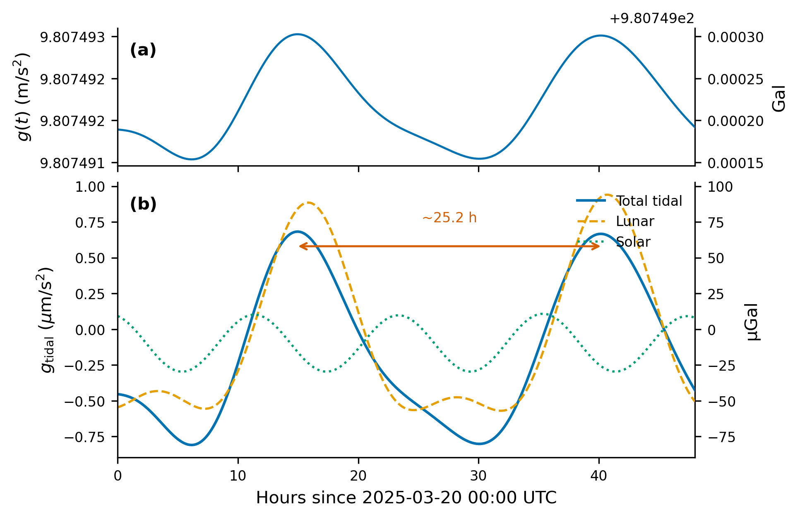
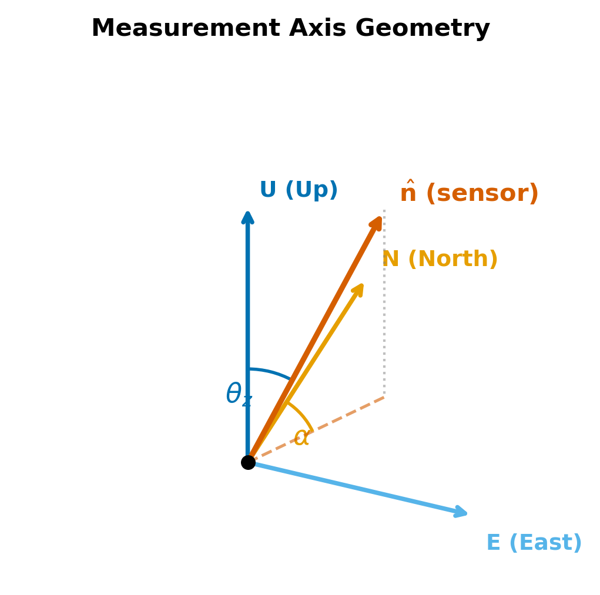

# Tutorial

Pytheas computes gravitational acceleration $g(t)$ at a point on Earth's surface. This tutorial walks through the API from simplest use to full lab-frame physics.

All examples use **Ulm, Eselsberg** (48.42°N, 9.96°E, 620 m) as a reference site.


## Installation

From PyPI:

```bash
pip install pytheas
```

From source:

```bash
git clone https://github.com/hyperion-git/pytheas.git && cd pytheas
pip install -e ".[plot]"
```

**Requirements:** Python $\ge$ 3.9, NumPy $\ge$ 1.20.  Matplotlib is optional (needed for `--plot`).

**Timezone handling:** All datetime arguments are interpreted as UTC.  Timezone-aware datetimes (e.g., `datetime(..., tzinfo=timezone(timedelta(hours=2)))`) are automatically converted to UTC before computation.  Naive datetimes are assumed to already be UTC.


## Single-Epoch Computation

`compute_g` returns the gravitational acceleration at one instant:

```python
from datetime import datetime
from pytheas import compute_g

result = compute_g(
    datetime(2025, 3, 20, 12, 0),
    lat_deg=48.42, lon_deg=9.96, alt_m=620.0,
)
```

The return value is a frozen dataclass, `GravityResult`:

```python
result.g_total      # 9.807374... m/s²  — total g on the measurement axis
result.g_static     # 9.807374... m/s²  — normal gravity projected on axis
result.g_normal     # 9.807374... m/s²  — normal gravity magnitude
result.cos_zenith   # 1.0               — cos(zenith angle)
result.g_tidal      # 2.64e-7 m/s²      — total tidal perturbation on axis
result.g_tidal_moon # 1.74e-7 m/s²      — lunar component
result.g_tidal_sun  # 8.98e-8 m/s²      — solar component
```

The tidal components are in m/s$^2$.  Multiply by $10^6$ for $\mu$m/s$^2$ (the conventional tidal unit):

```python
print(f"Tidal: {result.g_tidal * 1e6:.3f} µm/s²")
```


## Timeseries

`compute_timeseries` evaluates $g(t)$ over a time window:

```python
from datetime import datetime
from pytheas import compute_timeseries

data = compute_timeseries(
    start=datetime(2025, 3, 20),
    end=datetime(2025, 3, 22),
    lat_deg=48.42, lon_deg=9.96, alt_m=620.0,
    interval_minutes=10.0,
)
```

The return value is a `TimeSeries` dataclass.  The time-varying fields are NumPy arrays:

```python
data.times        # list[datetime], length N
data.g_total      # (N,) array — total g at each epoch
data.g_tidal      # (N,) array — tidal perturbation
data.g_tidal_moon # (N,) array — lunar component
data.g_tidal_sun  # (N,) array — solar component
data.g_static     # (N,) array — constant (static gravity on axis)
data.g_normal     # float      — normal gravity magnitude
data.cos_zenith   # float      — projection factor
```

To control the number of samples instead of the cadence:

```python
data = compute_timeseries(
    start=datetime(2025, 3, 20),
    end=datetime(2025, 3, 22),
    lat_deg=48.42, lon_deg=9.96, alt_m=620.0,
    n_samples=500,  # overrides interval_minutes
)
```

### Plotting

```python
import numpy as np
import matplotlib
matplotlib.use("Agg")
import matplotlib.pyplot as plt

hours = np.array([(t - data.times[0]).total_seconds() / 3600
                  for t in data.times])

fig, (ax1, ax2) = plt.subplots(2, 1, figsize=(10, 5), sharex=True)
ax1.plot(hours, data.g_total, "k-", lw=0.7)
ax1.set_ylabel("g_total (m/s²)")

ax2.plot(hours, data.g_tidal_moon * 1e6, label="Moon")
ax2.plot(hours, data.g_tidal_sun * 1e6, label="Sun")
ax2.plot(hours, data.g_tidal * 1e6, "k-", lw=0.9, label="Total")
ax2.set_ylabel("Tidal (µm/s²)")
ax2.set_xlabel("Hours")
ax2.legend()

fig.tight_layout()
fig.savefig("tidal_48h.png", dpi=150)
```




## Sensor Geometry

By default both `compute_g` and `compute_timeseries` assume a **vertical** measurement axis (zenith = 0).  For tilted or horizontal sensors, specify `zenith_deg` and `azimuth_deg`:

- **`zenith_deg`**: angle from vertical.  0 = straight up, 90 = horizontal.
- **`azimuth_deg`**: bearing of the horizontal projection, clockwise from north.  0 = north, 90 = east.



**Vertical sensor** (default):

```python
result = compute_g(dt, lat_deg=48.42, lon_deg=9.96, alt_m=620.0)
# cos_zenith = 1.0, g_static = g_normal
```

**Horizontal sensor pointing north**:

```python
result = compute_g(
    dt, lat_deg=48.42, lon_deg=9.96, alt_m=620.0,
    zenith_deg=90.0, azimuth_deg=0.0,
)
# cos_zenith ≈ 0, g_static ≈ 0
# Only the horizontal projection of tidal forces remains
```

**Tilted sensor** (15° from vertical toward east):

```python
result = compute_g(
    dt, lat_deg=48.42, lon_deg=9.96, alt_m=620.0,
    zenith_deg=15.0, azimuth_deg=90.0,
)
# cos_zenith ≈ 0.966, g_static ≈ 0.966 * g_normal
```

The static component scales as $\cos(\theta_\text{zenith})$.  The tidal projection depends on the full 3D geometry: a horizontal sensor picks up horizontal tidal forces that a vertical sensor cannot see.


## LabFrame API

For applications that need the full gravity vector, gradient tensor, and equation of motion (e.g., atom interferometry, inertial navigation), use `LabFrame` and `GravityField`:

```python
from datetime import datetime
from pytheas import LabFrame

lab = LabFrame(lat_deg=48.42, lon_deg=9.96, alt_m=620.0)
field = lab.field(datetime(2025, 3, 20, 12, 0))
```

`LabFrame` precomputes static quantities (position, ENU basis, normal gravity, rotation vector, Earth gradient tensor) at construction.  The `field()` method adds time-dependent tidal contributions and returns a `GravityField`:

```python
field.g              # (3,) gravity vector in ENU [m/s²]
                     # ≈ [0, 0, -9.807] + tidal
field.omega          # (3,) Earth rotation vector in ENU [rad/s]
                     # = [0, Ω·cos(φ), Ω·sin(φ)]
field.T              # (3,3) gravity gradient tensor [s⁻²]
field.g_normal       # normal gravity magnitude (float)
field.g_tidal_moon   # (3,) lunar tidal vector in ENU
field.g_tidal_sun    # (3,) solar tidal vector in ENU
```

All vectors use the **ENU** (East-North-Up) convention.  The gravity vector points downward, so `field.g[2] < 0`.

> **Sign convention — read this carefully.**
>
> | API | Vertical result | Convention |
> |-----|----------------|------------|
> | `compute_g().g_total` | **+9.807...** | Scalar reading on the measurement axis (positive = toward sensor) |
> | `field.g[2]` | **−9.807...** | Signed ENU vector component (negative = downward) |
> | `field.reading([0,0,1])` | **−9.807...** | Dot product of g with the Up axis |
>
> `compute_g()` reports the *magnitude* of the gravity projection, so a vertical sensor gives a positive number.  `GravityField` stores the *signed* ENU vector, so its Up component is negative at the surface.  These represent the same physics; the sign difference is purely a convention choice between the scalar and vector APIs.

### Gravity at an Offset

The gradient tensor maps displacements to gravity changes using the acceleration-gradient convention ($T_{ij} = \partial g_i / \partial x_j$):

```python
import numpy as np

# Gravity 1 meter above the lab origin
g_above = field.at([0, 0, 1.0])  # g + T @ [0,0,1]

# Gravity 10 meters east
g_east = field.at([10.0, 0, 0])
```

### Projected Reading

Project the gravity onto any axis (as a unit vector in ENU):

```python
# Vertical reading
g_vertical = field.reading([0, 0, 1])  # signed Up component = field.g[2] < 0

# Along a tilted axis (15 deg from vertical, toward east)
axis = np.array([np.sin(np.radians(15)), 0, np.cos(np.radians(15))])
g_tilted = field.reading(axis)

# With offset from lab origin
g_off = field.reading(axis, offset=[5.0, 0, 0])
```

For the Up axis, `field.reading([0, 0, 1])` therefore differs by a sign from `compute_g(...).g_total` for a vertical sensor.

### Equation of Motion

The `eom` method returns the acceleration in the rotating lab frame:

$$\mathbf{a} = \mathbf{g} + \mathbf{T} \cdot \delta\mathbf{x} - 2\,\boldsymbol{\Omega} \times \mathbf{v}$$

Centrifugal acceleration is absorbed into $\mathbf{g}$ (Somigliana) and $\mathbf{T}$ (Poisson trace); only Coriolis appears explicitly.

```python
# Acceleration at displacement dx with velocity v
dx = np.array([0.0, 0.0, 1.0])   # 1 m above origin
v  = np.array([0.0, 5.0, 0.0])   # 5 m/s northward
a  = field.eom(dx, v)             # (3,) acceleration in ENU
```

**Example: Coriolis deflection in a 10 cm free fall.**  A test mass dropped from rest at 48°N is deflected eastward by the Coriolis force.  A simple Euler integration:

```python
dt_step = 0.0001
dx = np.array([0.0, 0.0, 0.1])   # 10 cm above origin
v  = np.array([0.0, 0.0, 0.0])   # released from rest

while dx[2] > 0:
    a = field.eom(dx, v)
    v  += a * dt_step
    dx += v * dt_step

print(f"Eastward deflection: {dx[0]*1e6:.2f} µm")
# ≈ 0.47 µm — the classic Coriolis deflection
```

### When to Use LabFrame vs. compute_g

| Need | Use |
|------|-----|
| Scalar $g(t)$ on a fixed axis | `compute_g` / `compute_timeseries` |
| Full 3D gravity vector | `LabFrame.field().g` |
| Gravity gradient tensor | `LabFrame.field().T` |
| Equation of motion (Coriolis, gradients) | `LabFrame.field().eom()` |
| Gravity at multiple nearby points | `LabFrame.field().at()` |

### LabFrame Timeseries

```python
from datetime import datetime

lab = LabFrame(lat_deg=48.42, lon_deg=9.96, alt_m=620.0)
result = lab.timeseries(
    start=datetime(2025, 3, 20),
    end=datetime(2025, 3, 22),
    interval_minutes=10.0,
)
# result["times"]  — list[datetime]
# result["fields"] — list[GravityField]

# Extract vertical gravity component over time
g_up = [f.g[2] for f in result["fields"]]
```


## Command Line

The CLI computes a timeseries and prints a summary table:

```bash
# Default: 48h window, 10-min cadence, vertical sensor
pytheas --lat 48.42 --lon 9.96 --alt 620

# Custom window and export
pytheas --lat 48.42 --lon 9.96 --alt 620 \
    --start 2025-03-20 --hours 72 --interval 5 \
    --csv output.csv --plot

# Horizontal sensor pointing north
pytheas --lat 48.42 --lon 9.96 --alt 620 \
    --zenith 90 --azimuth 0
```

| Flag | Default | Description |
|------|---------|-------------|
| `--lat` | (required) | Geodetic latitude (deg) |
| `--lon` | (required) | Geodetic longitude (deg) |
| `--alt` | 0 | Altitude above ellipsoid (m) |
| `--zenith` | 0 | Zenith angle (0 = vertical) |
| `--azimuth` | 0 | Azimuth from north (deg) |
| `--start` | current UTC hour | Start time (YYYY-MM-DD or YYYY-MM-DDTHH:MM) |
| `--hours` | 48 | Duration (hours) |
| `--interval` | 10 | Cadence (minutes) |
| `--csv` | — | Write CSV to file |
| `--plot` | — | Show matplotlib plot |
| `--version` | — | Print version |

Or run as a module: `python -m pytheas --lat 48.42 --lon 9.96 --alt 620`

**Input validation.**  Both `compute_timeseries` and `LabFrame.timeseries` raise `ValueError` if `end < start` or if `interval_minutes <= 0` (when `n_samples` is not set).


## Recipes

### CSV Export from Python

```python
import csv
from datetime import datetime
from pytheas import compute_timeseries

data = compute_timeseries(
    start=datetime(2025, 3, 20),
    end=datetime(2025, 3, 27),
    lat_deg=48.42, lon_deg=9.96, alt_m=620.0,
)

with open("tidal.csv", "w", newline="") as f:
    w = csv.writer(f)
    w.writerow(["time_utc", "g_total", "g_tidal", "g_tidal_moon", "g_tidal_sun"])
    for i, t in enumerate(data.times):
        w.writerow([t.isoformat(), data.g_total[i], data.g_tidal[i],
                    data.g_tidal_moon[i], data.g_tidal_sun[i]])
```

### Dict Conversion

`GravityResult` and `TimeSeries` are frozen dataclasses.  For dict access:

```python
from dataclasses import asdict
from pytheas import compute_g
from datetime import datetime

result = compute_g(datetime(2025, 3, 20, 12, 0),
                   lat_deg=48.42, lon_deg=9.96, alt_m=620.0)
d = asdict(result)
# {'g_total': 9.807..., 'g_static': ..., 'g_tidal': ..., ...}
```

### LabFrame Tensor Timeseries

Extract gradient tensor components over time (useful for gradiometry):

```python
from datetime import datetime
from pytheas import LabFrame

lab = LabFrame(lat_deg=48.42, lon_deg=9.96, alt_m=620.0)
ts = lab.timeseries(
    start=datetime(2025, 3, 20),
    end=datetime(2025, 3, 22),
    interval_minutes=10.0,
)

# Vertical gravity gradient over time
T_UU = [f.T[2, 2] for f in ts["fields"]]

# Full tidal vector (Up component) over time
g_tidal_up = [f.g_tidal_moon[2] + f.g_tidal_sun[2] for f in ts["fields"]]
```

### Dict Conversion (note on immutability)

`GravityResult`, `TimeSeries`, and `GravityField` are frozen dataclasses with read-only arrays.  `dataclasses.asdict()` returns *mutable copies* of the data:

```python
from dataclasses import asdict
from pytheas import compute_g
from datetime import datetime

result = compute_g(datetime(2025, 3, 20, 12, 0),
                   lat_deg=48.42, lon_deg=9.96, alt_m=620.0)
d = asdict(result)
# {'g_total': 9.807..., 'g_static': ..., 'g_tidal': ..., ...}

# Direct mutation is blocked:
# result.g_total = 0.0  → FrozenInstanceError
# field.g[0] = 0.0      → ValueError (read-only array)
```

### Building Blocks

The internal functions are also exported for custom pipelines:

```python
from pytheas import (
    normal_gravity,
    sun_position_ecef, moon_position_ecef,
    geodetic_to_ecef, enu_basis, measurement_axis,
    tidal_acceleration, julian_date, gmst_rad,
    GM_MOON, GM_SUN, DELTA_GRAV,
)

# Normal gravity at the equator, sea level
g_eq = normal_gravity(lat_deg=0.0, alt_m=0.0)  # 9.7803253141 m/s²

# Moon position in ECEF at a given time
R_moon = moon_position_ecef(datetime(2025, 3, 20, 12, 0))

# Raw tidal acceleration (before elastic amplification)
r = geodetic_to_ecef(48.42, 9.96, 620.0)
a_raw = tidal_acceleration(r, R_moon, GM_MOON)
a_elastic = DELTA_GRAV * a_raw
```
